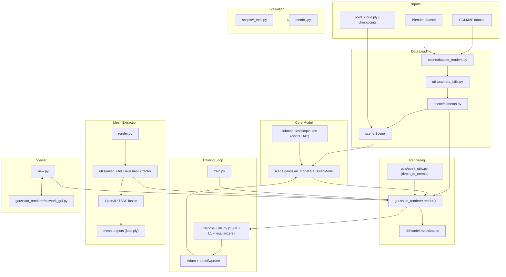

# Architecture Diagram (Commit 0d41037 and Earlier)

- Scope matches the repository layout and module wiring present at commit `0d41037`.
- Sonar-specific modules are intentionally excluded because they are not part of that commit.
