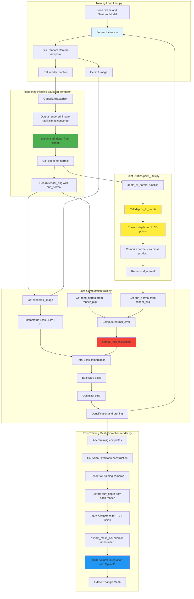
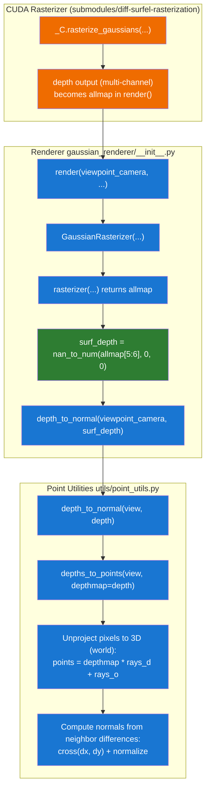

# Architecture Diagram: depths_to_points in Unbiased Surfel Sonar

<!-- Mermaid Diagram -->


## Key Data Flow:

1. **During Training (EVERY iteration - ~30,000+ times):**
   - `render()` produces `surf_depth` from rasterizer output
   - **⚡ `depth_to_normal()` calls `depths_to_points()`** to convert depth → 3D points
   - 3D points are used to compute surface normals via finite differences
   - `surf_normal` is compared with `rend_normal` for regularization loss
   - This happens **every training iteration**, making it a core training component

2. **During Post-Training Rendering/Evaluation:**
   - Same `render()` → `depth_to_normal()` → `depths_to_points()` pipeline runs
   - Used for visualization and evaluation

3. **During Mesh Extraction:**
   - `surf_depth` maps are collected from all camera viewpoints
   - These depth maps are used directly in TSDF fusion (no need for `depths_to_points` here)
   - Open3D handles the depth-to-point conversion internally for TSDF

4. **Purpose of depths_to_points:**
   - Converts 2D depth maps to 3D point clouds in world space
   - Enables computation of surface normals from depth for regularization
   - Critical for the normal consistency loss that improves geometry quality
   - **Not just used "at the end"** - it's integral to the training loop!

---

## Camera View Parameter Flow: Where does `view` come from in `depths_to_points(view, depthmap)`?

> Checked against the current codebase structure; line numbers may drift if files change.

```mermaid
flowchart TB
    Start["Scene.__init__ starts<br/>scene/__init__.py Line 30"] --> SI1["Call sceneLoadTypeCallbacks<br/>Line 49 or 52"]
    
    subgraph ImageLoading["Dataset Readers scene/dataset_readers.py"]
        SI1 --> IL1{"Dataset Type?"}
        IL1 -->|COLMAP| IL2["readColmapSceneInfo()<br/>Line 132"]
        IL1 -->|Blender| IL3["readNerfSyntheticInfo()<br/>Line 221"]
        IL2 --> IL4["readColmapCameras()<br/>Line 68, called at Line 145"]
        IL3 --> IL5["readCamerasFromTransforms()<br/>Line 179"]
        IL4 --> IL6["Image.open(image_path)<br/>Line 99"]
        IL5 --> IL7["Image.open(image_path)<br/>Line 202"]
        IL6 --> IL8["Create CameraInfo objects<br/>Line 101-102<br/>Contains: PIL Image, R, T, FovX, FovY"]
        IL7 --> IL8
        IL8 --> IL9["Wrap in SceneInfo<br/>train_cameras: List[CameraInfo]<br/>Line 172-177"]
        IL9 --> IL10["Return scene_info"]
    end
    
    IL10 --> SI2["Scene receives scene_info<br/>scene_info.train_cameras = CameraInfo list"]
    
    subgraph CameraCreation["Camera Object Creation utils/camera_utils.py"]
        SI2 --> CC1["cameraList_from_camInfos()<br/>scene_info.train_cameras<br/>scene/__init__.py Line 78"]
        CC1 --> CC2["For each CameraInfo:<br/>loadCam(args, id, cam_info)<br/>Line 56-60"]
        CC2 --> CC3["PILtoTorch(cam_info.image)<br/>Convert PIL → Torch tensor<br/>Line 43-49"]
        CC3 --> CC4["Create Camera object<br/>Camera(...image=gt_image...)<br/>Line 51-54"]
        CC4 --> CC5["Camera stores:<br/>- original_image (torch tensor)<br/>- world_view_transform<br/>- image_width/height<br/>- FoVx, FoVy, camera_center<br/>scene/cameras.py Line 42-62"]
        CC5 --> CC6["Return list of Camera objects"]
    end
    
    CC6 --> SI3["Store in self.train_cameras[scale]<br/>Line 78"]
    SI3 --> SI4["getTrainCameras() returns<br/>Camera object list<br/>Line 97-98"]
    
    subgraph TrainingLoop["Training Loop train.py"]
        SI4 --> TL1["scene.getTrainCameras().copy()<br/>Line 81"]
        TL1 --> TL2["Random selection:<br/>viewpoint_cam = viewpoint_stack.pop()<br/>Line 82"]
        TL2 --> TL3["viewpoint_cam is a Camera object<br/>Contains loaded image + params"]
    end
    
    subgraph Rendering["Rendering gaussian_renderer/__init__.py"]
        TL3 --> R1["render(viewpoint_camera, ...)<br/>Line 19"]
        R1 --> R2["GaussianRasterizer produces allmap"]
        R2 --> R3["Extract surf_depth from allmap<br/>Line 135"]
        R3 --> R4["depth_to_normal(viewpoint_camera, surf_depth)<br/>Line 138"]
    end
    
    subgraph PointUtils["Point Utilities utils/point_utils.py<br/>⚡ Called EVERY training iteration!"]
        R4 --> PU1["depth_to_normal(view, depth)<br/>Line 26"]
        PU1 --> PU2["depths_to_points(view, depthmap)<br/>Line 9<br/>⚡ Runs 30,000+ times during training"]
        PU2 --> PU3["Access view attributes:<br/>view.world_view_transform<br/>view.image_width<br/>view.image_height<br/>view.full_proj_transform<br/>Convert depth → 3D points"]
    end
    
    PU3 --> BackToTraining["surf_normal returned to render()<br/>Used in normal_loss computation<br/>train.py Line 109-111"]
    
    style IL6 fill:#4caf50
    style IL7 fill:#4caf50
    style IL8 fill:#90ee90
    style CC4 fill:#2196f3
    style CC5 fill:#87ceeb
    style TL2 fill:#ff9800
    style PU2 fill:#ffeb3b
    style PU3 fill:#ffeb3b
    style BackToTraining fill:#ff6b6b
```

<!-- Mermaid Diagram: Camera View Flow -->


### Key Points (Correct Execution Order):

1. **Scene Initialization Starts** (`scene/__init__.py`):
   - `Scene.__init__()` is called first (line 30)
   - Calls `sceneLoadTypeCallbacks["Colmap"]` or `["Blender"]` (line 49/52)

2. **Image Loading** (`scene/dataset_readers.py`):
   - `readColmapSceneInfo()` or `readNerfSyntheticInfo()` is called
   - These call `readColmapCameras()` (line 145) or `readCamerasFromTransforms()` (line 223)
   - Images loaded from disk using `Image.open()` (lines 99, 202)
   - Creates `CameraInfo` objects (NamedTuple with PIL Image + camera params)
   - Returns `SceneInfo` containing list of `CameraInfo` objects (line 172-177, 250-255)

3. **Back to Scene Initialization** (`scene/__init__.py`):
   - Scene receives `scene_info` with `train_cameras` = list of `CameraInfo`
   - Calls `cameraList_from_camInfos(scene_info.train_cameras, ...)` (line 78)

4. **Camera Object Creation** (`utils/camera_utils.py` → `scene/cameras.py`):
   - `cameraList_from_camInfos()` loops through each `CameraInfo`
   - Calls `loadCam()` for each (line 56-60)
   - `loadCam()` converts PIL Image → Torch tensor using `PILtoTorch()` (line 43-49)
   - Creates `Camera` objects (line 51-54)
   - `Camera` class stores image as `original_image` tensor and computes transforms (line 42-62)
   - Returns list of `Camera` objects

5. **Scene Storage** (`scene/__init__.py`):
   - Camera objects stored in `self.train_cameras[resolution_scale]` (line 78)
   - Accessed via `getTrainCameras()` method (line 97-98)

6. **Training Selection** (`train.py`):
   - Random Camera object selected from training cameras (line 81-82)
   - `viewpoint_cam` is a `Camera` instance with loaded image + all camera parameters

7. **Rendering Chain** (`gaussian_renderer/__init__.py` → `utils/point_utils.py`):
   - Camera flows: `render(viewpoint_camera)` → `depth_to_normal(viewpoint_camera, depth)` → `depths_to_points(view, depthmap)`
   - The `view` parameter provides camera intrinsics/extrinsics for depth-to-point conversion
   - **⚡ Critical**: This entire chain runs in **multiple contexts**:
     - **During training**: Every iteration (~30,000+ times) for normal regularization loss (train.py line 84, 109-111)
     - **During rendering**: Post-training mesh extraction and evaluation (render.py)
     - **During visualization**: Real-time viewing (view.py)
   - `depths_to_points()` is a **core function** used throughout, not just "at the end"!

---

## Camera Pose (Position & Orientation) Flow: From COLMAP to Rendering

> Checked against the current codebase; key conventions are called out explicitly below.

```mermaid
flowchart TB
    Start["🎥 COLMAP Output<br/>sparse/0/images.bin or images.txt"] --> ColmapFormat["Camera Pose Data:<br/>qvec: [qw, qx, qy, qz] (quaternion)<br/>tvec: [tx, ty, tz] (translation)<br/>Represents: World-to-Camera (w2c) transform<br/>COLMAP convention: X_cam = R_w2c · X_world + t_w2c"]
    
    subgraph ColmapLoader["COLMAP Loader scene/colmap_loader.py"]
        ColmapFormat --> CL1{"Binary or Text?"}
        CL1 -->|Binary| CL2["read_extrinsics_binary()<br/>Line 180-212"]
        CL1 -->|Text| CL3["read_extrinsics_text()<br/>Line 244-270"]
        CL2 --> CL4["Extract qvec, tvec<br/>Line 193-194 or 258-259"]
        CL3 --> CL4
        CL4 --> CL5["Create Image object<br/>Contains: qvec, tvec, camera_id, name<br/>Line 208-211 or 266-269"]
        CL5 --> CL6["Image.qvec2rotmat() available<br/>Line 68-70<br/>Uses qvec2rotmat() helper"]
    end
    
    CL6 --> DR1["Return dict of Image objects<br/>Indexed by image_id"]
    
    subgraph DatasetReader["Dataset Reader scene/dataset_readers.py"]
        DR1 --> DR2["readColmapSceneInfo()<br/>Line 132-177"]
        DR2 --> DR3["Calls readColmapCameras()<br/>cam_extrinsics, cam_intrinsics<br/>Line 145"]
        DR3 --> DR4["For each camera extrinsic:<br/>Line 70-76"]
        DR4 --> DR5["⚙️ Convert quaternion to rotation matrix:<br/>R = np.transpose(qvec2rotmat(extr.qvec))<br/>Line 82<br/>colmap_loader.py Line 43-53"]
        DR5 --> DR6["Extract translation:<br/>T = np.array(extr.tvec)<br/>Line 83"]
        DR6 --> DR7["Create CameraInfo:<br/>CameraInfo(uid, R, T, FovY, FovX, ...)<br/>Line 101-102"]
        DR7 --> DR8["Store pose pieces in CameraInfo:<br/>R = R_c2w (rotation, camera→world)<br/>T = t_w2c (translation, world→camera)"]
    end
    
    DR8 --> SI1["Return SceneInfo with list of CameraInfo<br/>Each contains R, T matrices"]
    
    subgraph CameraConstruction["Camera Object Construction scene/cameras.py"]
        SI1 --> CAM1["Camera.__init__(R, T, ...)<br/>Line 20-24"]
        CAM1 --> CAM2["Store pose:<br/>self.R = R<br/>self.T = T<br/>Line 29-30"]
        CAM2 --> CAM3["🔧 Build World-to-View Transform:<br/>world_view_transform =<br/>getWorld2View2(R, T, trans, scale)<br/>Line 59<br/>utils/graphics_utils.py Line 38-49"]
        CAM3 --> CAM4["Build Projection Matrix:<br/>projection_matrix =<br/>getProjectionMatrix(znear, zfar, fovX, fovY)<br/>Line 60<br/>graphics_utils.py Line 51-71"]
        CAM4 --> CAM5["Compose Full Transform:<br/>full_proj_transform =<br/>world_view_transform @ projection_matrix<br/>Line 61"]
        CAM5 --> CAM6["Extract Camera Center:<br/>camera_center =<br/>world_view_transform.inverse()[3, :3]<br/>Line 62"]
        CAM6 --> CAM7["Compute inverse:<br/>ndc2world = full_proj_transform.inverse()<br/>Line 63"]
    end
    
    CAM7 --> Usage["Camera object stored with transforms<br/>Ready for rendering"]
    
    subgraph RenderingUsage["Usage in Rendering Pipeline"]
        Usage --> RU1["🎨 GaussianRasterizer<br/>gaussian_renderer/__init__.py Line 45-46"]
        RU1 --> RU2["Pass to CUDA kernel:<br/>viewmatrix=viewpoint_camera.world_view_transform<br/>projmatrix=viewpoint_camera.full_proj_transform<br/>Transforms Gaussians to screen space"]
        
        Usage --> RU3["🔄 Transform Normals<br/>gaussian_renderer/__init__.py Line 124"]
        RU3 --> RU4["Convert view space → world space:<br/>render_normal @ world_view_transform[:3,:3].T"]
        
        Usage --> RU5["📐 depths_to_points()<br/>utils/point_utils.py Line 9-24"]
        RU5 --> RU6["Compute Camera-to-World:<br/>c2w = (world_view_transform.T).inverse()<br/>Line 10"]
        RU6 --> RU7["Build intrinsics from projection:<br/>projection_matrix = c2w.T @ full_proj_transform<br/>Line 16-17"]
        RU7 --> RU8["Generate ray directions:<br/>rays_d = pixels @ intrins.inverse() @ c2w[:3,:3].T<br/>Line 21"]
        RU8 --> RU9["Get ray origin from pose:<br/>rays_o = c2w[:3,3]<br/>Line 22"]
        RU9 --> RU10["Convert depth to 3D points:<br/>points = depth * rays_d + rays_o<br/>Line 23<br/>⚡ Used 30,000+ times in training!"]
    end
    
    RU10 --> Final["3D points in world coordinates<br/>Used for normal computation and losses"]
    
    %% Color Legend:
    %% RED: COLMAP raw data input
    %% ORANGE: Quaternion/rotation conversion
    %% GREEN: Matrix construction
    %% BLUE: Rendering usage
    
    style ColmapFormat fill:#c62828,color:#fff
    style CL5 fill:#d32f2f,color:#fff
    style DR5 fill:#ef6c00,color:#fff
    style DR6 fill:#ef6c00,color:#fff
    style DR8 fill:#f57c00,color:#fff
    style CAM3 fill:#2e7d32,color:#fff
    style CAM4 fill:#388e3c,color:#fff
    style CAM5 fill:#43a047,color:#fff
    style CAM6 fill:#4caf50,color:#fff
    style CAM7 fill:#66bb6a,color:#fff
    style RU2 fill:#1565c0,color:#fff
    style RU4 fill:#1976d2,color:#fff
    style RU10 fill:#1e88e5,color:#fff
    style Final fill:#2196f3,color:#fff
```

<!-- Mermaid Diagram: Camera Pose Flow -->


### Color Legend:
- 🔴 **Red nodes**: COLMAP raw data input (qvec, tvec from SfM)
- 🟠 **Orange nodes**: Quaternion-to-rotation matrix conversion
- 🟢 **Green nodes**: Transformation matrix construction (world_view_transform, projection_matrix, etc.)
- 🔵 **Blue nodes**: Active usage in rendering pipeline (rasterization, depth unprojection)

### Camera Pose Transformation Pipeline:

1. **COLMAP Output (Camera Extrinsics)**:
   - **qvec**: Quaternion `[qw, qx, qy, qz]` encoding the **world→camera** rotation $R_{w2c}$
   - **tvec**: Translation vector `[tx, ty, tz]` is the **world→camera** translation $t_{w2c}$
   - COLMAP convention: $X_{cam} = R_{w2c} X_{world} + t_{w2c}$
   - Camera center in world coords: $C_{world} = -R_{w2c}^T t_{w2c}$

2. **COLMAP Loader Processing** (`scene/colmap_loader.py`):
   - `read_extrinsics_binary()` or `read_extrinsics_text()` reads qvec and tvec
   - `qvec2rotmat(qvec)` converts quaternion → 3×3 rotation matrix (line 43-53)
   - Returns `Image` objects containing raw qvec and tvec

3. **Dataset Reader Conversion** (`scene/dataset_readers.py`):
   - `readColmapCameras()` processes each camera (line 68-105)
   - **Key transformation**: `R = np.transpose(qvec2rotmat(extr.qvec))` (line 82)
     - `qvec2rotmat(extr.qvec)` yields $R_{w2c}$
     - Transpose converts to $R_{c2w} = R_{w2c}^T$
   - `T = np.array(extr.tvec)` stores $t_{w2c}$ as-is (line 83)
   - Creates `CameraInfo(R=R_c2w, T=t_w2c, ...)` (line 101-102)

4. **Camera Object Construction** (`scene/cameras.py`):
   - Receives R and T from CameraInfo (line 20, 29-30)
   - **Builds transformation matrices**:
     - `world_view_transform = getWorld2View2(R, T, trans, scale)` (line 59)
       - In this repo, `loadCam()` does **not** pass `trans`/`scale`, so defaults are used (`trans=[0,0,0]`, `scale=1`)
       - Effective world→camera is built as $R_{w2c} = R^T$ and $t_{w2c} = T$
     - `projection_matrix = getProjectionMatrix(znear, zfar, fovX, fovY)` (line 60)
       - Perspective projection: camera space → clip space
     - `full_proj_transform = world_view_transform @ projection_matrix` (line 61)
       - Complete pipeline: world → camera → clip space
     - `camera_center = world_view_transform.inverse()[3, :3]` (line 62)
       - Camera position in world coordinates
     - `ndc2world = full_proj_transform.inverse()` (line 63)
       - Inverse transform for unprojection

5. **Usage in Rendering** (Multiple locations):

   **A. Gaussian Rasterization** (`gaussian_renderer/__init__.py`):
   - Passes `world_view_transform` and `full_proj_transform` to CUDA rasterizer (line 45-46)
   - Transforms each Gaussian primitive from world space to screen space
   - Used to project 3D Gaussians onto 2D image plane

   **B. Normal Space Transformation** (`gaussian_renderer/__init__.py`):
   - Transforms normals from view space to world space (line 124)
   - Uses `world_view_transform[:3,:3].T` (rotation part only)

   **C. Depth-to-Point Conversion** (`utils/point_utils.py`):
   - **Most critical usage for geometry**:
     - Computes camera-to-world: `c2w = (world_view_transform.T).inverse()` (line 10)
     - Builds projection matrix and extracts intrinsics (line 16-17)
     - Generates ray directions using intrinsics and rotation (line 21)
     - Gets camera position from pose: `rays_o = c2w[:3,3]` (line 22)
     - **Unprojects depth to 3D points**: `points = depth * rays_d + rays_o` (line 23)
     - **⚡ Runs 30,000+ times during training** for normal regularization loss!

### Mathematical Summary:

```
COLMAP Pose (qvec, tvec)
    ↓
R_w2c = qvec2rotmat(qvec)  (world→camera)
t_w2c = tvec
    ↓
Stored in this codebase:
R = R_c2w = R_w2c^T
T = t_w2c
    ↓
World-to-View (w2c) = [R^T | T]
                      [ 0  | 1 ]
Camera center in world = -R · T
    ↓
Full Projection = World-to-View @ Perspective Projection
    ↓
Used for:
  • Forward: World → Screen (Rasterization)
  • Inverse: Screen + Depth → World (depths_to_points)
  • Normal transformations
  • Camera center extraction
```

### Key Insight:

The camera pose from COLMAP undergoes several transformations but **preserves the geometric relationship** between the camera and the 3D scene. This allows:
- **Forward rendering**: Project 3D Gaussians to 2D images
- **Inverse rendering**: Unproject depth maps back to 3D points for normal computation
- **Consistency**: The same pose parameters ensure geometric consistency across the entire training and rendering pipeline

---

## Pseudo-Surface Depth (`surf_depth`) Flow: Where does `surf_depth` come from?

> In this codebase, `surf_depth` (the default “depth view” and the depth used for TSDF fusion) is **computed by the CUDA rasterizer** (not loaded from disk). The rasterizer returns a multi-channel tensor called `depth` in `diff_surfel_rasterization`, which `gaussian_renderer.render()` names `allmap` and then slices into the specific maps.

```mermaid
flowchart TB
    subgraph Inputs["Inputs to Rendering"]
        C0["Camera (scene/cameras.py)<br/>- world_view_transform<br/>- full_proj_transform<br/>- FoVx/FoVy<br/>- image_width/height<br/>- camera_center<br/>- ndc2world"] --> R0
        G0["GaussianModel (scene/gaussian_model.py)<br/>- xyz (means3D)<br/>- opacity<br/>- scaling/rotation or cov3D<br/>- SH/features or override_color"] --> R0
        P0["Pipeline settings<br/>- bg_color<br/>- scale_modifier"] --> R0
    end

    subgraph Renderer["Renderer gaussian_renderer/__init__.py"]
        R0["render(viewpoint_camera, pc, ...)"] --> R1["Create GaussianRasterizationSettings<br/>pass viewmatrix=world_view_transform<br/>pass projmatrix=full_proj_transform<br/>pass ndc2world, campos, tanfovx/y"]
        R1 --> R2["GaussianRasterizer(...)"]
        R2 --> R3["rasterizer(...)<br/>returns: rendered_image, radii, allmap, converge<br/>Line 98"]

        R3 --> A0["rend_alpha = allmap[1:2]"]
        R3 --> D0["render_depth_expected = allmap[0:1] / rend_alpha<br/>nan_to_num(...)<br/>Line 126-130"]
        R3 --> S0["surf_depth = nan_to_num(allmap[5:6], 0, 0)<br/>(pseudo surface depth, Eq. 9)<br/>Line 134-136"]
        R3 --> N0["rend_normal = allmap[2:5]<br/>then view→world transform<br/>Line 123-125"]
        R3 --> Dist0["rend_dist = allmap[6:7]<br/>Line 131-133"]
    end

    subgraph CUDA["CUDA Rasterizer (submodules/diff-surfel-rasterization)"]
        R2 --> C1["diff_surfel_rasterization/_C.rasterize_gaussians(...)<br/>returns: color, depth, converge, ..."]
        C1 --> C2["depth output (named allmap in render())<br/>contains multiple channels (alpha, depth variants, normals, dist, ...)"]
    end

    subgraph DepthUsage["Where `surf_depth` is used"]
        S0 --> U1["Normals from depth<br/>utils/point_utils.py: depth_to_normal(view, surf_depth)<br/>used for normal consistency loss"]
        S0 --> U2["Visualization output 'depth'<br/>utils/image_utils.py: render_pkg['surf_depth']"]
        S0 --> U3["Mesh / TSDF fusion input<br/>utils/mesh_utils.py collects depthmaps<br/>Open3D integrates them"]
        S0 --> U4["Tensorboard/debug depth images<br/>train.py logs render_pkg['surf_depth']"]
    end
    
    %% Color Legend:
    %% PURPLE: Input sources
    %% BLUE: Rendering pipeline
    %% ORANGE: CUDA rasterizer (core computation)
    %% GREEN: Depthmap extraction
    %% YELLOW: Usage destinations
    
    style C0 fill:#9c27b0,color:#fff
    style G0 fill:#9c27b0,color:#fff
    style P0 fill:#9c27b0,color:#fff
    style R0 fill:#1976d2,color:#fff
    style R1 fill:#1976d2,color:#fff
    style R2 fill:#1976d2,color:#fff
    style R3 fill:#1976d2,color:#fff
    style C1 fill:#ef6c00,color:#fff
    style C2 fill:#ef6c00,color:#fff
    style S0 fill:#2e7d32,color:#fff
    style D0 fill:#43a047,color:#fff
    style A0 fill:#66bb6a,color:#fff
    style N0 fill:#66bb6a,color:#fff
    style Dist0 fill:#66bb6a,color:#fff
    style U1 fill:#fdd835,color:#000
    style U2 fill:#fdd835,color:#000
    style U3 fill:#fdd835,color:#000
    style U4 fill:#fdd835,color:#000
```

<!-- Mermaid Diagram: Depthmap Origin -->


### Color Legend:
- 🟣 **Purple nodes**: Input sources (Camera, GaussianModel, Pipeline settings)
- 🔵 **Blue nodes**: Rendering pipeline flow (render function, rasterizer setup)
- 🟠 **Orange nodes**: CUDA rasterizer (core computation where depth is generated)
- 🟢 **Green nodes**: Depthmap extraction from `allmap` (surf_depth, render_depth_expected, alpha, normals, dist)
- 🟡 **Yellow nodes**: Usage destinations (normal computation, visualization, TSDF fusion, logging)

### Key takeaway:

- **`surf_depth` originates inside the CUDA rasterizer**: `GaussianRasterizer(...) → _C.rasterize_gaussians(...) → depth output → (named `allmap`) → slice `allmap[5:6]`**.
- There is also an **“expected depth”** (`allmap[0:1] / alpha`) and other auxiliary maps; the repo’s default “depth view” and TSDF pipeline uses **`surf_depth`** (`render_pkg["surf_depth"]`).

---

## `depthmap` Argument Flow: Where does `depths_to_points(view, depthmap)` get its `depthmap`?

> In this repo, `depths_to_points(...)` is only called by `depth_to_normal(view, depth)` (same file). Today, the `depth`/`depthmap` passed in is the renderer-produced **`surf_depth`** from `gaussian_renderer.render()`.

<!-- Mermaid Diagram: depths_to_points depthmap source -->


### What this means in practice:

- The `depthmap` passed into `depths_to_points(view, depthmap)` is **`surf_depth`** coming from `gaussian_renderer.render()` (unless you add new callsites).

---

## Mathematical Derivation: Ray-Surfel Intersection in 2D Gaussian Splatting

> This section explains how a ray cast through a pixel intersects with a 2D Gaussian surfel primitive.

### 1. The 2D Gaussian Surfel Primitive

Unlike 3D Gaussian Splatting (which uses ellipsoids), **2D Gaussian Splatting (2DGS)** represents each primitive as a **surfel** — a flat, oriented disk embedded in 3D space. Think of it like a small patch on a surface (similar to panel methods in hydrodynamics or boundary element methods).

Each surfel is defined by:

| Parameter | Symbol | Description |
|-----------|--------|-------------|
| Center | $\mathbf{p}_c \in \mathbb{R}^3$ | Position in world frame |
| Tangent vectors | $\mathbf{t}_u, \mathbf{t}_v \in \mathbb{R}^3$ | Local axes on the surfel plane |
| Normal | $\mathbf{n} = \mathbf{t}_u \times \mathbf{t}_v$ | Perpendicular to the surfel |
| Scales | $s_u, s_v \in \mathbb{R}^+$ | Extent of the Gaussian in each tangent direction |

Any point on the surfel plane can be written as:

$$
\mathbf{p}(u, v) = \mathbf{p}_c + u \cdot s_u \mathbf{t}_u + v \cdot s_v \mathbf{t}_v
$$

where $(u, v)$ are **local coordinates** on the surfel plane.

### 2. The 2D Gaussian Function

The Gaussian "intensity" at a point $(u, v)$ on the surfel is:

$$
G(u, v) = \exp\left( -\frac{1}{2} \left( u^2 + v^2 \right) \right)
$$

This is a **standard 2D Gaussian with unit variance** ($\sigma = 1$), centered at $(0, 0)$.

**Why unit variance?** The actual size of the Gaussian in world space is controlled by the scale parameters $s_u$ and $s_v$, not by $\sigma$. The transformation from world coordinates to local surfel coordinates already incorporates the scaling:

$$
u = \frac{\text{(distance from center along } \mathbf{t}_u \text{)}}{s_u}
$$

So if a point is at distance $s_u$ from the center, then $u = 1$ and $G(1, 0) = e^{-0.5} \approx 0.606$. At distance $3s_u$ (the "3-sigma" boundary): $u = 3$ and $G(3, 0) \approx 0.011$.

### 3. The Rendering Problem: Where Does a Ray Hit the Surfel?

#### 3.1 Camera Model

A pinhole camera at position $\mathbf{o} \in \mathbb{R}^3$ (camera origin) casts a ray through each pixel $(p_x, p_y)$. The ray is:

$$
\mathbf{r}(t) = \mathbf{o} + t \cdot \mathbf{d}
$$

where $\mathbf{d}$ is the ray direction (computed from pixel coordinates and camera intrinsics), and $t \geq 0$ is the distance along the ray.

#### 3.2 The Surfel Plane Equation

The surfel lies on a plane. Using the center $\mathbf{p}_c$ and normal $\mathbf{n}$, any point $\mathbf{p}$ on the plane satisfies:

$$
(\mathbf{p} - \mathbf{p}_c) \cdot \mathbf{n} = 0
$$

#### 3.3 Ray-Plane Intersection (Classical Approach)

Substituting the ray equation into the plane equation:

$$
(\mathbf{o} + t\mathbf{d} - \mathbf{p}_c) \cdot \mathbf{n} = 0
$$

Solving for $t$:

$$
t^* = \frac{(\mathbf{p}_c - \mathbf{o}) \cdot \mathbf{n}}{\mathbf{d} \cdot \mathbf{n}}
$$

The intersection point in 3D is $\mathbf{p}^* = \mathbf{o} + t^* \mathbf{d}$.

To get the **local coordinates** $(u, v)$ on the surfel, we project onto the tangent vectors:

$$
u = \frac{(\mathbf{p}^* - \mathbf{p}_c) \cdot \mathbf{t}_u}{s_u \|\mathbf{t}_u\|^2}, \quad
v = \frac{(\mathbf{p}^* - \mathbf{p}_c) \cdot \mathbf{t}_v}{s_v \|\mathbf{t}_v\|^2}
$$

### 4. The Efficient Approach: Homogeneous Coordinates

The above classical approach requires multiple operations per ray-surfel pair. 2DGS uses a clever **homogeneous coordinate** formulation that's more efficient for GPU rasterization.

#### 4.1 The Transformation Matrix $\mathbf{T}$

We precompute a $3 \times 3$ matrix $\mathbf{T}$ for each surfel that encodes the **surfel-to-pixel mapping**. Let:

- $\mathbf{W}$ = World-to-camera transformation (4×4)
- $\mathbf{P}$ = Projection matrix (4×4, perspective)
- $\mathbf{N}$ = NDC-to-pixel mapping (3×4)

The surfel's local frame in homogeneous coordinates is:

$$
\mathbf{M}_{\text{splat}} = 
\begin{bmatrix}
s_u \mathbf{t}_u & s_v \mathbf{t}_v & \mathbf{p}_c \\
0 & 0 & 1
\end{bmatrix}
\in \mathbb{R}^{4 \times 3}
$$

The columns represent: scaled tangent $u$, scaled tangent $v$, and center (in homogeneous coords).

The transformation matrix is:

$$
\mathbf{T} = \mathbf{M}_{\text{splat}}^\top \cdot \mathbf{W} \cdot \mathbf{P} \cdot \mathbf{N} \in \mathbb{R}^{3 \times 3}
$$

Denote the **rows** of $\mathbf{T}$ as $\mathbf{T}_u$, $\mathbf{T}_v$, $\mathbf{T}_w \in \mathbb{R}^3$.

#### 4.2 Ray-Surfel Intersection via Cross Product

For a pixel at $(p_x, p_y)$, define two **implicit planes** in homogeneous coordinates:

$$
\mathbf{h}_1 = p_x \cdot \mathbf{T}_w - \mathbf{T}_u
$$

$$
\mathbf{h}_2 = p_y \cdot \mathbf{T}_w - \mathbf{T}_v
$$

**Geometric interpretation**: 
- $\mathbf{h}_1$ represents all points in the scene that project to the same $x$-coordinate as $p_x$
- $\mathbf{h}_2$ represents all points that project to the same $y$-coordinate as $p_y$

The **intersection** of these two planes with the surfel plane is the ray-surfel intersection point. In homogeneous coordinates:

$$
\tilde{\mathbf{s}} = \mathbf{h}_1 \times \mathbf{h}_2 = (s_x, s_y, s_w)
$$

Converting to local surfel coordinates:

$$
(u, v) = \left( \frac{s_x}{s_w}, \frac{s_y}{s_w} \right)
$$

If $s_w = 0$, the ray is parallel to the surfel (no intersection).

#### 4.3 Depth Computation

The depth (distance along the camera's $z$-axis) at the intersection is:

$$
z = u \cdot T_{w,x} + v \cdot T_{w,y} + T_{w,z}
$$

where $\mathbf{T}_w = (T_{w,x}, T_{w,y}, T_{w,z})$.

### 5. Anti-Aliasing: The Low-Pass Filter

At grazing angles (ray nearly parallel to surfel), the projected Gaussian becomes very elongated, causing aliasing. 2DGS uses a **minimum** of two distance metrics:

**3D distance** (on the surfel plane):

$$
\rho_{3D} = u^2 + v^2
$$

**2D distance** (in pixel space):

$$
\rho_{2D} = \frac{2}{f^2} \left[ (c_x - p_x)^2 + (c_y - p_y)^2 \right]
$$

where $(c_x, c_y)$ is the projected surfel center.

The **effective distance** used for the Gaussian:

$$
\rho = \min(\rho_{3D}, \rho_{2D})
$$

This acts as a low-pass filter, preventing extreme values at grazing angles.

### 6. Alpha Blending: The Rendering Equation

Each surfel has an opacity $\alpha_0 \in [0, 1]$. The per-pixel contribution is:

$$
\alpha = \alpha_0 \cdot G(u, v) = \alpha_0 \cdot \exp\left( -\frac{\rho}{2} \right)
$$

For multiple overlapping surfels (sorted by depth), the color at a pixel is computed via **front-to-back alpha blending**:

$$
C = \sum_{i=1}^{N} c_i \cdot \alpha_i \cdot T_i
$$

where:
- $c_i$ = color of surfel $i$
- $\alpha_i$ = alpha of surfel $i$
- $T_i = \prod_{j=1}^{i-1} (1 - \alpha_j)$ = transmittance (how much light passes through all surfels in front)

This is the same volumetric rendering equation used in NeRF, but with discrete primitives.

### 7. Summary: The Full Pipeline

```mermaid
flowchart TB
    subgraph Preprocessing["Preprocessing (Per Surfel)"]
        P1["Build local frame: L = R(q) · S(s_u, s_v)"] --> P2["Compute T = M_splat^T · W · P · N"]
        P2 --> P3["Compute bounding box & assign to tiles"]
    end
    
    subgraph Rasterization["Rasterization (Per Pixel)"]
        R1["For each overlapping surfel (depth-sorted):"] --> R2["Compute h₁ = p_x·T_w - T_u"]
        R2 --> R3["Compute h₂ = p_y·T_w - T_v"]
        R3 --> R4["Intersection: (u,v) = cross(h₁,h₂) / s_w"]
        R4 --> R5["Distance: ρ = min(u² + v², ρ_2D)"]
        R5 --> R6["Alpha: α = α₀ · exp(-ρ/2)"]
        R6 --> R7["Blend: C += c·α·T, T *= (1-α)"]
        R7 --> R8{"T < ε?"}
        R8 -->|Yes| R9["Early termination"]
        R8 -->|No| R1
    end
    
    P3 --> R1
    
    style R4 fill:#ffeb3b
    style R6 fill:#4caf50
    style R7 fill:#2196f3
```

<!-- Mermaid Diagram: Ray-Surfel Intersection Pipeline -->


### 8. Key Equations Summary

| Quantity | Formula |
|----------|---------|
| Local coordinates | $(u, v) = \left( \frac{(\mathbf{h}_1 \times \mathbf{h}_2)_x}{(\mathbf{h}_1 \times \mathbf{h}_2)_z}, \frac{(\mathbf{h}_1 \times \mathbf{h}_2)_y}{(\mathbf{h}_1 \times \mathbf{h}_2)_z} \right)$ |
| Gaussian value | $G = \exp\left( -\frac{1}{2}(u^2 + v^2) \right)$ |
| Alpha | $\alpha = \alpha_0 \cdot G$ |
| Depth | $z = u \cdot T_{w,x} + v \cdot T_{w,y} + T_{w,z}$ |
| Pixel color | $C = \sum_i c_i \alpha_i \prod_{j<i}(1-\alpha_j)$ |

### 9. Physical Intuition (Engineering Analogy)

Think of each surfel as a **small planar element** (like in panel methods for potential flow or boundary element methods in acoustics):

| Concept in 2DGS | Engineering Analogy |
|-----------------|---------------------|
| Surfel | Panel/facet on a discretized surface |
| Gaussian weight $G(u,v)$ | Influence function (decays from center) |
| Normal $\mathbf{n}$ | Panel orientation |
| Alpha blending | Superposition of contributions |
| Depth sorting | Accounting for occlusion/shadowing |

The key advantage of 2DGS over 3DGS for **depth estimation** is that the ray-surfel intersection gives you a **precise depth value** at the intersection point, rather than an ambiguous "depth to the center of an ellipsoid."
