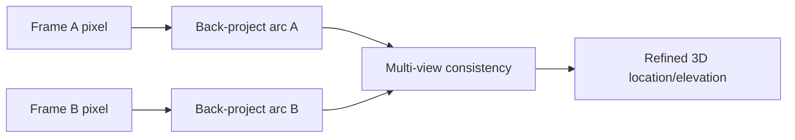
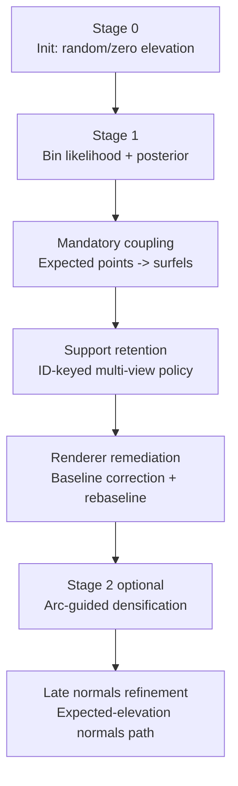
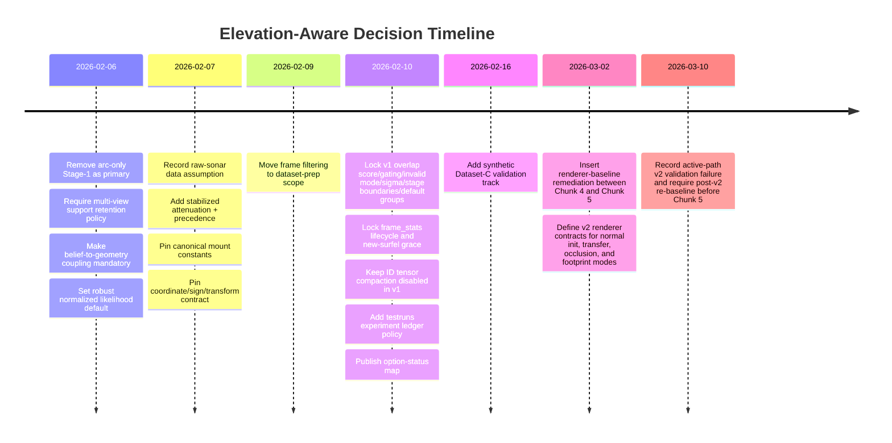
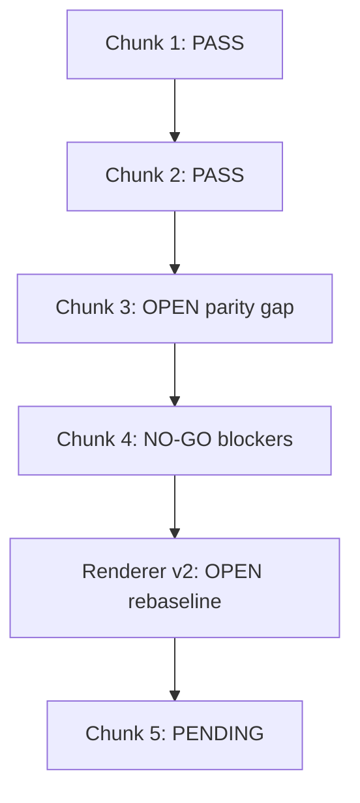

# Plan: Elevation-Aware Training (Flow-Structured Master Overview)

**Date:** 2026-02-24  
**Purpose:** Re-structure the full elevation-aware plan into implementation flow (`Chunk 1 -> 5`) without losing original plan content.  
**Source lineage:**
- Base decision ledger: `plans/PLAN_ELEVATION_AWARE_TRAINING_2026-01-28.md`
- Contract-level source of truth: `plans/PLAN_ELEVATION_AWARE_TRAINING_detailed_2026-02-01.md`
- Chunk execution/governance: `plans/PLAN_ELEVATION_AWARE_IMPLEMENTATION_EXECUTION_2026-02-10.md`
- Renderer remediation tranche: `plans/PLAN_MISSING_OCCLUSION_AND_RENDERER_FIX_2026-03-02.md`

---

## Read this first

This document is intentionally flow-first (implementation order) instead of history-first (decision addenda order).

Completeness policy for this file:
- Every major concept and decision category from the base plan is represented here.
- Detailed formulas/interfaces/defaults stay authoritative in the detailed plan.
- Historical exploratory alternatives are preserved as a dedicated option catalog so context is not lost.

Session-note procedure carried forward from base plan:
1. Track issues point-by-point in `scratchpad.md` with file references.
2. Resolve issues by updating the detailed plan first with executable contracts.
3. Add brief decision summaries in high-level docs, linking to detailed contracts.
4. Keep high-level docs focused on flow/status and detailed docs focused on implementation mechanics.

Reader guide carried forward from base plan:
- Elevation stages in this program are `Stage 0/1/2` (init, bin-likelihood+c coupling, optional densification).
- Existing `debug_multiframe.py` curriculum stage labels are separate phase names and should not be treated as 1:1 elevation-stage numbers.
- Exploratory option sections are context unless explicitly promoted by later decision updates.

---

## Problem statement (carried over, flow-oriented)

### Core limitation

Current naive back-projection assumes a single elevation (`elevation=0`) for each sonar pixel.

Real sonar ambiguity:
- A single `(col,row)` corresponds to an **elevation arc** at fixed azimuth/range and varying elevation within beam extent.
- Forward rendering is many-to-one (many 3D points can map to one pixel).
- Back-projection is one-to-many (one pixel can imply multiple plausible 3D points).

### Why multi-view is the leverage point

With overlapping orbit views, the same surface is constrained differently from each pose, allowing elevation ambiguity to collapse under consistency pressure.

Sign-convention carryover:
- Camera/view frame is canonical for implementation (`+X right, +Y down, +Z forward`).
- `+elevation -> +Y` and `-elevation -> -Y` in that frame.

---

## Design constraints (carried over)

- Elevation is not deterministically solved at initialization.
- Stage 0 may sample a random prior over elevation; Stage 1+ resolves ambiguity via training.
- Hardware target is laptop-scale (8 GB VRAM class), typical training subset around 500 frames.
- Priority policy: make it work first, optimize after behavior is stable.

---

## End-goal and staged architecture

Program goal: improve mesh-faithful geometry under sonar elevation ambiguity, not just image loss.

Stage intent:
1. Stage 0: elevation-aware initialization.
2. Stage 1: GT-anchored bin likelihood + entropy/temperature shaping.
3. Stage 1 coupling/support: force posterior belief to move surfel geometry and enforce multi-view support retention.
4. Renderer-baseline remediation and post-v2 re-baselining before late refinements are interpreted.
5. Stage 2 (optional): densify along arc peaks for persistent high-error areas.
6. Late refinements: normals path ramp once posterior confidence is sufficient.

---

## Flow by implementation chunk

## Chunk 1: Safety rails + geometry contracts

**Focus**
- Conventions, projection/back-projection contracts, attenuation path and diagnostics.

**What this chunk established**
- Convention assertions and run-header observability.
- Projection contract safety rails used by later stage logic.
- Range attenuation integration and precedence behavior.

**Status**
- Implemented and validated.

Reference: `plans/PLAN_ELEVATION_AWARE_CHUNK1_EXECUTION_2026-02-10.md`

---

## Chunk 2: Stage 0 behavior

**Focus**
- Elevation-aware initialization mode control (`random|zero`).
- Fixed-opacity default behavior and compatibility.

**What this chunk established**
- Random elevation init default with explicit zero fallback.
- Fixed-opacity default path for sonar training.
- Stage-0 diagnostics and checkpoint/resume coverage.

**Status**
- Implemented and validated.

Carry-forward observation:
- Cross-view support depth remained weak and frame dominance remained high; this was expected to be solved by later Stage-1 evidence and coupling/support machinery.

Reference: `plans/PLAN_ELEVATION_AWARE_CHUNK2_EXECUTION_2026-02-11.md`

---

## Chunk 3: Stage 1 likelihood core

**Focus**
- Overlap/sampling/pixel-bank/logit/reliability/annealing infrastructure.
- Cache interfaces for coupling handoff.

**What is in place**
- Mode gates and frame-keyed runtime state.
- Checkpoint schema/fingerprint framework.
- Contract/smoke test scaffolding and passing fast suites.

**Open parity gap (critical)**
- Training-loop Stage-1 likelihood path still has an interim surrogate.
- Full overlap-neighbor evidence assembly via `back_project_bins` and full projection-validity gating is not yet fully matched to contract intent.

**Status**
- Partially implemented; gate open.

Reference: `plans/PLAN_ELEVATION_AWARE_CHUNK3_EXECUTION_2026-02-16.md`

---

## Chunk 4: Belief-to-geometry enforcement

**Focus**
- Coupling term, persistent surfel IDs, support/pruning lifecycle with warmup/threshold/hysteresis/grace.

**What is in place**
- Coupling/support mechanisms and lifecycle plumbing integrated.
- Broad test and closeout evidence executed.

**Current gate posture**
- NO-GO at closeout snapshot due to explicit blockers:
  1. Dataset-C synthetic gate failure.
  2. Coupling residual threshold miss.
  3. Incomplete manual artifact verdict at closeout point.

Probe interpretation:
- Increasing support-prune/coupling pressure did not robustly correct cube-class failure mode.
- Harsh settings drove collapse/deletion behavior rather than shape-corrective convergence.

**Status**
- Implemented but blocked.

Reference: `plans/PLAN_ELEVATION_AWARE_CHUNK4_EXECUTION_2026-02-23.md`

---

## Renderer remediation / rebaseline (post-Chunk-4, pre-Chunk-5)

**Focus**
- Normal-init ingestion, gradient-safe Lambertian transfer, ray-binned occlusion, renderer-v2 footprint modes, densification-signal wiring, and post-v2 synthetic re-baselining.

**Why this sits here**
- Chunk-4 investigation showed renderer-level defects were upstream of both Stage-1 evidence quality and Chunk-4 coupling/support behavior.
- Therefore this tranche is a prerequisite gate before late Chunk-5 normals work is interpreted.

**Current posture**
- Implemented in code, but active-path validation / synthetic re-baseline posture is still open.
- Pre-v2 Chunk-4 evidence is historical when compared against renderer-v2 runs.

Reference: `plans/PLAN_MISSING_OCCLUSION_AND_RENDERER_FIX_2026-03-02.md`

---

## Chunk 5: Late-stage refinements

**Focus (planned)**
- Normals ramp and expected-elevation normals path.
- Optional densification hooks (off by default until stable).

**Readiness dependency**
- Should start only after Chunk-3 parity gap, renderer-remediation gate, and post-v2 Chunk-4 blocker posture are resolved or explicitly waived.

**Status**
- Pending.

Reference: `plans/PLAN_ELEVATION_AWARE_IMPLEMENTATION_EXECUTION_2026-02-10.md`

---

## Exploratory option catalog from original plan (preserved)

This section preserves the original alternative landscape from the base plan.

### Addendum alternatives

1. Elevation distribution per pixel (bins/latent).
2. Stochastic elevation sampling (Monte Carlo).
3. Two-stage elevation solver (geometry-first then photometric refinement).

### Option 1: Point-to-point loss with learnable elevation

#### 1A: Per-pixel learnable elevation
- Learn elevation per valid pixel.
- Multi-view consistency from paired correspondences.
- High parameter count, direct gradient to elevation.

#### 1B: Surfel-centric elevation constraint
- Constrain surfel positions to arcs of rendered pixels.
- Multi-view arc intersection consistency.
- Lower parameter overhead, more indirect optimization path.

### Option 2: Cycle consistency with elevation

- Single-frame cycle is weak and can punish correct elevation under zero-elevation back-projection assumption.
- Multi-frame cycle (arc intersection/min-distance) is stronger and can expose scale/correspondence issues.

### Option 3: Guided densification with elevation search

- For high-error bright pixels, evaluate arc bins across overlapping frames and spawn surfels at score peaks.
- Supports one-to-many by multi-peak detection.

### Idea A: Probabilistic latent elevation

- Maintain per-pixel elevation distribution (discrete bins or parametric forms).
- Bayesian-style multi-view belief updates.
- Render via expectation/sampling/mixture variants.
- Naturally supports multi-modal one-to-many cases.

### Idea B: Elevation prediction network

- Predict elevation from local/global sonar context via small CNN.
- Potential cross-frame/new-frame generalization but risk of overfitting or weak signal learnability.

### Idea C: Implicit elevation through enhanced surfel optimization

- No explicit latent elevation; rely on multi-view reprojection/geometric losses to create elevation gradients.
- Lower parameter overhead but potentially slower or weaker convergence on ambiguous cases.

### Comparative framing (from base plan)

- Explicit approaches (distribution/network) improve ambiguity handling but cost more complexity.
- Implicit/surfel-centric approaches are lighter but can under-handle one-to-many ambiguity.

### Original option-comparison matrix (preserved, condensed)

| Option | Elevation representation | Multi-view usage | One-to-many handling | Complexity |
|---|---|---|---|---|
| 1A | Per-pixel scalar | Correspondence loss | Explicit per-pixel | Medium |
| 1B | Implicit in surfel position | Arc/surfel constraint | Via surfel count | Low |
| 2 | Arc intersection/cycle | Core mechanism | Via intersection/min-distance | Medium |
| 3 | Arc search during densify | Multi-frame score | Multi-peak add | Medium |
| A | Distribution over elevation | Belief update | Multimodal by design | High |
| B | Predicted by network | End-to-end | By model capacity | Medium |
| C | Implicit via optimization | Enhanced losses | Via surfel count | Low |

Historical option-status carryover:
- Active implementation path is the Stage-0 random init + Stage-1 bin likelihood + mandatory coupling + optional Stage-2 densification.
- Arc-only Stage-1 as primary is deprecated.
- Several alternatives remain exploratory/reference unless re-promoted.

---

## Decision convergence from the original ledger

## Historical gap note (original)

Base plan explicitly called out two missing high-level decisions:
1. Primary elevation-aware loss formulation and staging.
2. Normals path timing and coupling to elevation confidence.

These were later resolved as follows.

## Resolved direction: loss + normals

- Stage-1 primary driver: GT-anchored bin likelihood with entropy/temperature shaping.
- Arc term remains optional low-weight stabilizer, not primary driver.
- Baseline photometric/bright-pixel losses remain active.
- Stage-2 densification is optional and targeted.
- Normals regularization is weak early, stronger later once beliefs stabilize.
- Mesh fidelity is the decision objective; not pure image-loss optimization.

## Fixed-opacity decision (sonar)

- Default policy: fully opaque surfels in sonar path with optional toggle for learnable-opacity ablation.
- Rationale: domain physical prior for hard-surface sonar reflection and removal of opacity-normal compensation degrees of freedom.

## Normals correctness concern (appearance vs geometry)

- Multi-view training is the main safeguard against appearance-only normal cheating.
- Deferring normals correctness to export time is risky because geometry and normals co-adapt during training.
- Candidate normal-stability mechanisms preserved:
  - normal-gated neighborhood smoothness,
  - multi-view normal consistency,
  - elevation-derived normal consistency.

## Sonar intensity physics decision

- Move from plain Lambert term to stabilized distance attenuation family:
  - `I = lambert * gain / (max(r, r0)^p + eps)`.
- Raw-data assumption implies attenuation ON by default.
- Start from `p=2.0`, near-range floor (`r0`) enabled, tune via mesh-first ablations.

## Scattering-model decision

- Ignore richer scattering/BRDF-like complexity for current phase.
- Use single Lambertian reflectance model as practical approximation.
- Accept limitation that specular pool-surface behavior is not modeled yet.

---

## Correspondence strategy decision (preserved)

Options considered in base plan:
- A: surfel-anchored correspondence.
- B: elevation-arc projection correspondence.
- C: intensity matching on constrained epipolar geometry.
- D: no explicit correspondence (implicit multi-view via loss).

Chosen default path:
- Start with **Option D** (implicit, no global correspondence map).
- Escalate to surfel-anchored explicit correspondence only if convergence/geometry quality indicates need.

---

## Recommended path + integration feedback (preserved)

Converged implementation path from base plan discussions:
- Stage 0 random elevation-aware init.
- Stage 1 discrete-bin GT-anchored likelihood with small initial `K` and configurability for larger `K` later.
- Mandatory coupling from belief to geometry.
- Optional Stage 2 densification.
- Fixed schedules first for reproducibility; later metric-aware schedule tightening can be added.

Rationale preserved from original recommendation:
- Keep VRAM footprint practical by using one primary optimization stage after initialization.
- Resolve one-to-many ambiguity without per-pixel-parameter explosion.
- Keep optional complexity (densification) targeted to persistent high-error regions.

Feedback-to-incorporate items preserved:
- Stage 0 should randomize elevation rather than forcing zero.
- Start with discrete bins (stable/debuggable), keep `K` configurable.
- Keep Stage 2 optional.
- Define schedule triggers for temperature, coupling ramp, and support pruning strictness.

Integration-decision posture preserved:
- Accept random init over full elevation FOV by default.
- Use discrete bins first, expandable later.
- Keep arc stabilizer optional and low-weight.
- Progression defaults are fixed schedules first, with optional early tightening based on metrics.

Historical-next-steps note from base plan (preserved as milestone context):
- Expand probabilistic elevation path details.
- Design concrete loss functions.
- Finalize data structures/memory budget.
- Plan phased implementation.

---

## Decision-update timeline (all key updates preserved)

### 2026-02-06 updates

- Remove arc-only geometry-first Stage-1 as primary due to self-referential failure mode.
- Keep optional arc term as low-weight stabilizer only.
- Enforce multi-view support policy beyond FOV-only checks (validity + meaningful return + residual + viewpoint diversity + schedule + hysteresis).
- Make belief-to-geometry coupling mandatory with robust association and warmup/ramp policy.
- Adopt robust normalized likelihood model with neutral invalid evidence and reliability weighting.

### 2026-02-07 updates

- Record raw-amplitude sonar data assumption.
- Keep attenuation ON by default; attenuation OFF is diagnostic ablation only.
- Add stabilized attenuation model and deterministic precedence for OFF/AUTO/MANUAL gain behavior.
- Record canonical sonar-camera mount tuple and require run-header logging.
- Pin coordinate convention and transform storage contract; enforce with startup checks.

### 2026-02-09 update

- Frame filtering belongs to dataset preparation, not runtime training loop.
- Pipeline preserved: quality gate -> pose dedup -> diverse subsample -> connectivity check.
- Training consumes precomputed selected frame lists.

### 2026-02-10 updates

- Overlap-table uses pose-only score v1 with hard gates.
- Stage-1 likelihood/support must use full projection-valid mask (`in_fov & in_front & in_bounds`).
- Invalid likelihood mode fixed to neutral in v1.
- Coupling sigma policy fixed in v1; adaptive deferred.
- Stage boundaries fixed-iteration gates in v1; hybrid transitions deferred.

Default-group decisions preserved from base plan:
- Group A: frame pairing/workload defaults.
- Group B: likelihood optimization defaults.
- Group C: reliability normalization defaults.
- Group D: coupling weight/gate defaults.
- Group E: support/pruning dynamic defaults.
- Group F: secondary schedule defaults.

Additional lifecycle decisions preserved:
- `frame_stats` treated as run-static in v1; rebuild only when active frame set changes.
- New-surfel age grace added for support pruning.
- ID-tensor compaction disabled in v1; monotonic ID growth accepted with future follow-up.

Experiment tracking decision preserved:
- Adopt `testruns/` ledger (`run.md`, `config.env`, `metrics.json`, indexed summaries).

Option-status map preserved:
- Active: Stage-0 random init + Stage-1 bin likelihood + mandatory coupling + optional Stage-2 densification.
- Deprecated as primary: arc-only Stage-1.
- Exploratory/reference: options 1A/1B/2 and Ideas B/C unless re-promoted.

### 2026-02-16 update

- Add synthetic Dataset-C (cube) validation track parallel to Dataset-A process.
- Preserve deterministic generation/gating/evaluation/repeatability flow.
- Initial acceptance thresholds were defined as:
  - mean surface distance `<= 0.05 m`,
  - p95 surface distance `<= 0.10 m`,
  - center error `<= 0.03 m`,
  - fixed-seed repeatability expectation.
- Use A + C as paired synthetic sanity ladder: smooth-shape and edge/corner behavior coverage.

---

## Configuration/default philosophy preserved

The base plan locked groups of defaults rather than ad-hoc tuning. This flow keeps that policy:
- Pin deterministic v1 defaults for reproducibility.
- Use explicit policy knobs for future tuning, not silent behavior drift.
- Keep optional features disabled by default until baseline contracts are stable.

Exact names/values remain in:
- `plans/PLAN_ELEVATION_AWARE_TRAINING_detailed_2026-02-01.md` (`Configuration / Flags`).

---

## Validation philosophy preserved

- Mesh-first success criteria over image-loss-only success criteria.
- Synthetic datasets are mandatory validation tracks for later chunks.
- Resume/continuation checks are part of chunk gates.
- Manual visual checks supplement scalar metrics where needed.

---

## Current implementation-state note (flow snapshot)

Status carried from execution/chunk records:
- Chunk 1: implemented and validated.
- Chunk 2: implemented and validated.
- Chunk 3: partially implemented (infrastructure landed; full Stage-1 evidence-path parity open).
- Chunk 4: implemented and closeout-tested, but currently NO-GO due to blockers.
- Renderer remediation: implemented in code after Chunk-4 investigation, but active-path validation and synthetic re-baselining remain open.
- Chunk 5: pending.

---

## Immediate next actions (flow-ordered)

1. Close or explicitly bracket the Chunk-3 Stage-1 likelihood parity gap against the detailed contract path.
2. Complete renderer-v2 active-path validation and post-v2 synthetic re-baseline.
3. Re-run Chunk-4 gates against the corrected Stage-1 path under matching renderer-v2 fingerprints.
4. Re-assess Dataset-C blocker with consistent comparator hygiene.
5. Record explicit GO/NO-GO decision with blocker resolution or approved waiver rationale.
6. Start Chunk 5 only after core evidence-to-geometry and renderer-baseline posture are validated.

---

## Open questions and standing assumptions

Open hardware/budget concern from base plan remains practical context:
- Work must remain feasible on laptop-class resources (base-plan context: 8 GB VRAM class laptop, 32 GB RAM, i9-class CPU); optimization follows correctness.

Standing assumptions carried forward:
- Raw sonar amplitude data regime.
- Canonical mount and sign conventions.
- Dataset-prep frame filtering ownership.
- Deterministic v1 behavior first.

---

## Authorship lineage (preserved)

From original plan lineage:
- Collaborative development across `opus4.5`, `gpt-5.2-codex`, and user input (with later updates in chunk plans and detailed-plan alignment).

---

## Reading map

Decision ledger and historical context:
- `plans/PLAN_ELEVATION_AWARE_TRAINING_2026-01-28.md`

Contract-level formulas/interfaces/defaults:
- `plans/PLAN_ELEVATION_AWARE_TRAINING_detailed_2026-02-01.md`

Execution sequencing and chunk gate policy:
- `plans/PLAN_ELEVATION_AWARE_IMPLEMENTATION_EXECUTION_2026-02-10.md`

Chunk evidence records:
- `plans/PLAN_ELEVATION_AWARE_CHUNK1_EXECUTION_2026-02-10.md`
- `plans/PLAN_ELEVATION_AWARE_CHUNK2_EXECUTION_2026-02-11.md`
- `plans/PLAN_ELEVATION_AWARE_CHUNK3_EXECUTION_2026-02-16.md`
- `plans/PLAN_ELEVATION_AWARE_CHUNK4_EXECUTION_2026-02-23.md`
- `plans/PLAN_MISSING_OCCLUSION_AND_RENDERER_FIX_2026-03-02.md`

---

## Coverage map from base plan

This checklist maps each major section family from `plans/PLAN_ELEVATION_AWARE_TRAINING_2026-01-28.md` into this flow document.

| Base-plan section family | Coverage in this file |
|---|---|
| Session note procedure | `Read this first` |
| Implementation status note | `Current implementation-state note (flow snapshot)` |
| Problem statement + elevation arc + asymmetry + multi-view opportunity | `Problem statement (carried over, flow-oriented)` |
| Design constraints | `Design constraints (carried over)` |
| Reader guide + stage naming caution | `Read this first` |
| Authorship | `Authorship lineage (preserved)` |
| Addendum alternatives (distribution/sampling/two-stage) | `Exploratory option catalog from original plan` |
| Option 1/2/3 and Ideas A/B/C | `Exploratory option catalog from original plan` |
| Option comparison summary | `Original option-comparison matrix` |
| Historical next steps | `Recommended path + integration feedback` |
| Missing high-level decisions note (loss + normals) | `Decision convergence from the original ledger` |
| Loss + normals response | `Resolved direction: loss + normals` |
| Fixed opacity decision | `Fixed-opacity decision (sonar)` |
| Normals concern and mitigation approaches | `Normals correctness concern (appearance vs geometry)` |
| Sonar intensity physics update | `Sonar intensity physics decision` |
| Surface scattering deferral | `Scattering-model decision` |
| Open hardware question | `Open questions and standing assumptions` |
| Correspondence mechanism options and selected default | `Correspondence strategy decision (preserved)` |
| Recommended path + rationale | `Recommended path + integration feedback` |
| Feedback to incorporate + integration decisions | `Recommended path + integration feedback` |
| Decision updates (2026-02-06 to 2026-02-16) | `Decision-update timeline (all key updates preserved)` + dated subsections |
| Frame filtering as dataset-prep policy | `2026-02-09 update` |
| Overlap score/full-valid-mask/neutral-invalid/sigma/stage boundaries | `2026-02-10 updates` |
| Group A-F defaults | `2026-02-10 updates` |
| `frame_stats` lifecycle, new-surfel grace, ID compaction policy | `2026-02-10 updates` |
| Experiment ledger (`testruns/`) | `2026-02-10 updates` |
| Option status map | `Exploratory option catalog` + `2026-02-10 updates` |
| Synthetic Dataset-C track and thresholds | `2026-02-16 update` |
