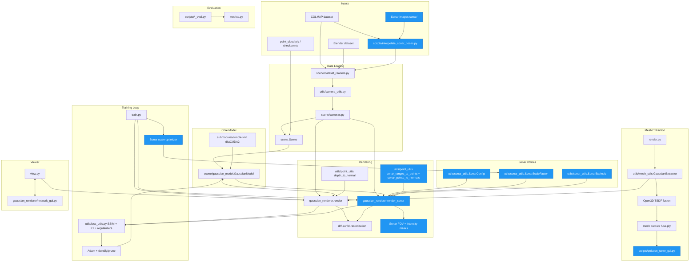
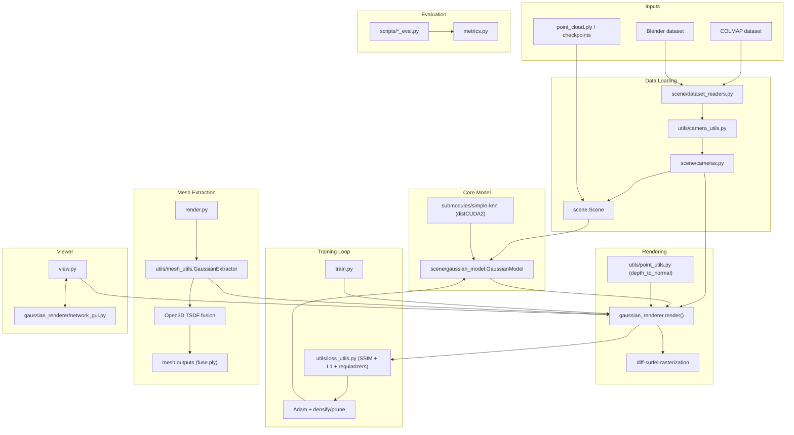
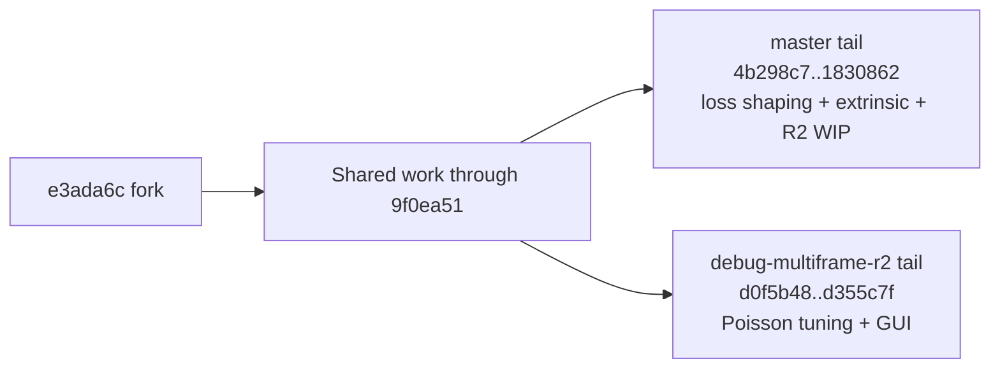
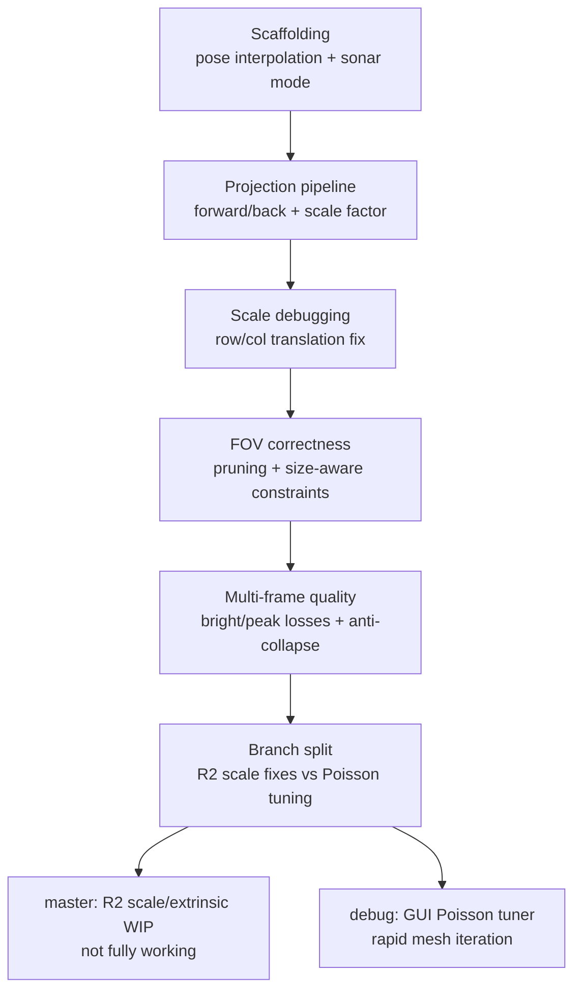

# Progress Overview (Post-Fork, Multi-Branch)

## Current Architecture (Sonar Extensions)

## Baseline Architecture (Commit 0d41037)

## Scope and Method
- Fork point: `e3ada6c`.
- Branches analyzed: `master`, `debug-multiframe-r2` (local).
- Evidence: commit history, diff stats, and plan/progress docs (`plans/*.md`, `PROGRESS.md`, `progress.md`, `SONAR_MODIFICATIONS.md`, `docs/DESIGN_DECISIONS.md`, `DATASET_PREPARATION.md`, `R2_DATASET_ISSUES.md`).
- Effort proxy: commit count, diff stats (files/lines), plus narrative notes from plans and progress logs.

## Branch Summary
| Branch | Commits since fork | Diff stats since fork | Focus tail (unique to branch) |
| --- | --- | --- | --- |
| `master` | 19 | 22 files, 6285 insertions, 42 deletions | Peak-aware/anti-collapse loss, extrinsic offset, R2 scale WIP (5 unique commits) |
| `debug-multiframe-r2` | 17 | 27 files, 6295 insertions, 41 deletions | Poisson mesh filters, GUI tuner, brightness slider (3 unique commits) |

## Approach Ledger (What Was Tried, Effort, Outcome)

### 1) Sonar mode + pose interpolation scaffolding
- Evidence: `a5ef72d`, `4958d0d`; docs `SONAR_MODIFICATIONS.md`, `DATASET_PREPARATION.md`.
- Effort proxy: 2 commits, 6 files changed, 854 insertions, 3 deletions.
- What was done: sonar mode toggle, pose interpolation script, dataset conventions, early extrinsic TODO.
- Outcome: foundation laid for sonar-specific data flow and COLMAP pose reuse.
- Friction later: naming constraints (camera_*.png) and dataset mismatches show up in R2 notes (`R2_DATASET_ISSUES.md`).

### 2) Core sonar projection pipeline + scale factor + debug harness
- Evidence: `71b82f8`, `a844961`, `0b503ab`, `6c7f2de`, `9379438`, `929568d`; docs `PROGRESS.md`, `docs/DESIGN_DECISIONS.md`, `SONAR_MODIFICATIONS.md`.
- Effort proxy: 7 commits, 15 files changed, 3740 insertions, 60 deletions.
- What was done:
  - `render_sonar()` forward projection and `sonar_ranges_to_points()` backward projection.
  - `SonarScaleFactor` for metric alignment; gradient bug fixed via row-3 translation.
  - Debug scripts to validate backward+forward reproduction.
- Outcome: working sonar render path with scale sensitivity; debug shows correct reproduction.
- Stuck point: scale learning still drifts to ~1.0 when expected ~0.66 (not fully resolved in `PROGRESS.md`).

### 3) FOV correctness, pruning, and size-aware constraints
- Evidence: `63f287a`, `a76ae8e`, `389f9d2`, `df8428e`; plan `plans/PLAN_sonar_mesh_extraction.md`; notes in `progress.md`.
- Effort proxy: 4 commits, 5 files changed, 745 insertions, 31 deletions.
- What was done: intensity thresholding, freeze scale factor, FOV pruning, size-aware FOV checks.
- Outcome: surfels largely constrained to FOV; mesh still extends slightly beyond due to TSDF interpolation.
- Stuck point: residual mesh outside FOV and early mesh-before-training mismatch noted in `progress.md`.

### 4) Multi-frame fidelity and highlight preservation
- Evidence: `9f0ea51` (shared), `4b298c7`, `ff4aac6` (master only).
- Effort proxy:
  - Shared: 1 commit, 2 files changed, 193 insertions, 12 deletions.
  - Master tail (loss shaping): part of 5 commits, 1019 insertions, 202 deletions (see approach 5).
- What was done: bright-pixel loss, peak-aware loss, anti-collapse loss, peak-gated pruning.
- Outcome: attempts to preserve thin bright returns and prevent collapse.
- Stuck point: multi-frame loss oscillations and missing fine bright dots noted in `PROGRESS.md`.

### 5) Extrinsic offset + R2 scale/mesh debugging (master track)
- Evidence: `cec5c77`, `37d763c`, `1830862`; docs `progress.md`, `R2_DATASET_ISSUES.md`.
- Effort proxy: 5 commits in master tail, 1019 insertions, 202 deletions (overlaps with approach 4 work).
- What was done: applied sonar extrinsic offset, anti-collapse improvements, attempted R2 scale fixes and row/col translation convention fix (WIP).
- Outcome: partial fixes; some were marked broken or not fully working.
- Stuck points (from `progress.md` and `R2_DATASET_ISSUES.md`):
  - R2 dataset is not just pose update; intrinsics and frames differ, scale is non-uniform.
  - FOV visibility remains sparse; some points behind sonar due to transform mismatch.
  - Mesh scale/offset issues persist; WIP fixes not fully validated.

### 6) Poisson mesh tuning + GUI workflow (debug-multiframe-r2 track)
- Evidence: `d0f5b48`, `b2e1fcb`, `d355c7f`; plans `PLAN_GUI_POISSON_TUNER_2026-01-17.md`, `PLAN_R2_MESH_GAP_2026-01-17.md`, `PLAN_R2_SCALE_FIX_2026-01-17.md`.
- Effort proxy: 3 commits, 11 files changed, 912 insertions, 84 deletions.
- What was done: Poisson mesh filters, GUI-based tuner, brightness slider for rapid iteration.
- Outcome: tooling in place for tuning mesh extraction, but still WIP and not tied to a resolved R2 scale fix.
- Stuck point: plan explicitly flags unreliable prior fixes and requires re-validation.

## Effort Heatmap (By Subsystem and File)

### Subsystem Churn (master)
| Subsystem | Insertions | Deletions | Total churn |
| --- | --- | --- | --- |
| Debug Pipelines | 3168 | 367 | 3535 |
| Docs/Notes | 1672 | 60 | 1732 |
| Sonar Utils | 776 | 78 | 854 |
| Scripts/Tools | 609 | 0 | 609 |
| Rendering Core | 396 | 50 | 446 |
| Training/Scene | 193 | 22 | 215 |

### Subsystem Churn (debug-multiframe-r2)
| Subsystem | Insertions | Deletions | Total churn |
| --- | --- | --- | --- |
| Debug Pipelines | 2600 | 174 | 2774 |
| Docs/Notes | 1848 | 40 | 1888 |
| Scripts/Tools | 892 | 1 | 893 |
| Sonar Utils | 693 | 27 | 720 |
| Rendering Core | 394 | 49 | 443 |
| Training/Scene | 133 | 21 | 154 |

### Top Churn Files (master)
| File | Insertions | Deletions | Total churn |
| --- | --- | --- | --- |
| `debug_multiframe.py` | 2166 | 286 | 2452 |
| `utils/sonar_utils.py` | 581 | 68 | 649 |
| `debug_before_after_mesh.py` | 541 | 81 | 622 |
| `scripts/interpolate_sonar_poses.py` | 518 | 0 | 518 |
| `gaussian_renderer/__init__.py` | 396 | 50 | 446 |
| `PROGRESS.md` | 408 | 30 | 438 |

### Top Churn Files (debug-multiframe-r2)
| File | Insertions | Deletions | Total churn |
| --- | --- | --- | --- |
| `debug_multiframe.py` | 1598 | 93 | 1691 |
| `debug_before_after_mesh.py` | 541 | 81 | 622 |
| `scripts/interpolate_sonar_poses.py` | 518 | 0 | 518 |
| `utils/sonar_utils.py` | 496 | 16 | 512 |
| `gaussian_renderer/__init__.py` | 394 | 49 | 443 |
| `scripts/poisson_tuner_gui.py` | 283 | 1 | 284 |

## Decision Timeline (Pivots and Outcomes)

## Where Progress Slowed or Stuck
- **Scale factor learning**: documented convergence mismatch (expected ~0.66 vs learned ~1.0). Fixes improve gradient flow but not convergence.
- **R2 dataset shift**: pose and intrinsics differences plus frame mismatch make it a new dataset, not a drop-in replacement; scale and orientation variance break assumptions.
- **FOV and mesh consistency**: even with size-aware FOV, TSDF/marching cubes introduce out-of-FOV mesh surface; mesh gaps persist in R2.
- **Multi-frame quality**: oscillating losses and missing bright dots led to repeated loss shaping and pruning iterations.

## LLM Plan Inventory and Status
| Plan doc | LLM attribution | Goal | Status |
| --- | --- | --- | --- |
| `plans/PLAN_sonar_mesh_extraction.md` | Claude Opus 4.5 | Size-aware FOV constraints | Implemented (`df8428e`); residual FOV mesh leakage remains. |
| `plans/PLAN_R2_SCALE_FIX_2026-01-17.md` | Not specified | R2 scale alignment | Still WIP; fixes marked unreliable. |
| `plans/PLAN_R2_MESH_GAP_2026-01-17.md` | Not specified | Diagnose R2 mesh gaps | Not resolved; Poisson fallback proposed. |
| `plans/PLAN_GUI_POISSON_TUNER_2026-01-17.md` | Not specified | GUI for Poisson tuning | WIP tooling added in debug branch. |

## Strategic Takeaways
- Most effort has gone into the core projection pipeline and debug harness, followed by repeated quality tuning and pruning.
- The project shifted from geometry correctness to quality tuning, then to dataset-specific fixes (R2) and mesh tooling.
- The main blockers are scale identifiability and R2 dataset non-equivalence, which both undermine downstream mesh quality.

## Recent Updates (2026-01-27)
- Single-frame R2 run recorded (see snapshots) showed good surfel alignment but TSDF meshes outside FOV and often empty; Poisson meshes succeeded.
- Added `SONAR_NUM_FRAMES` env override in `debug_multiframe.py` to control training frame count.
- Fixed Poisson filtering alignment bug when applying opacity + scale filters sequentially.
- Recorded mesh extraction notes and sonar-native TSDF plan in snapshots for future implementation.
