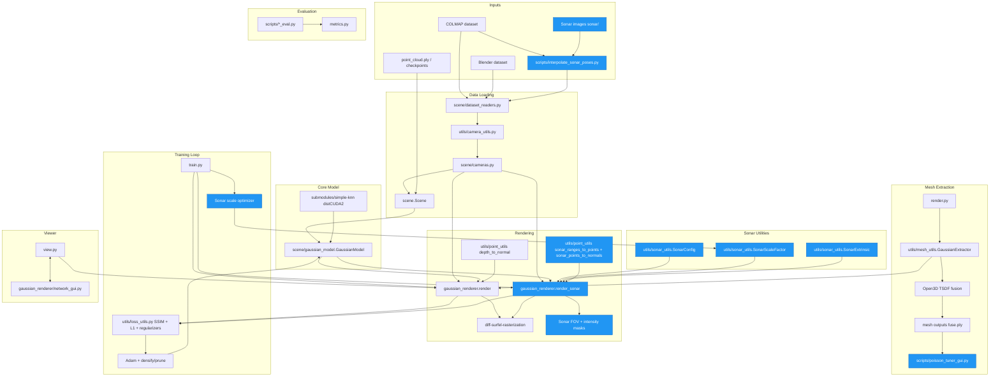
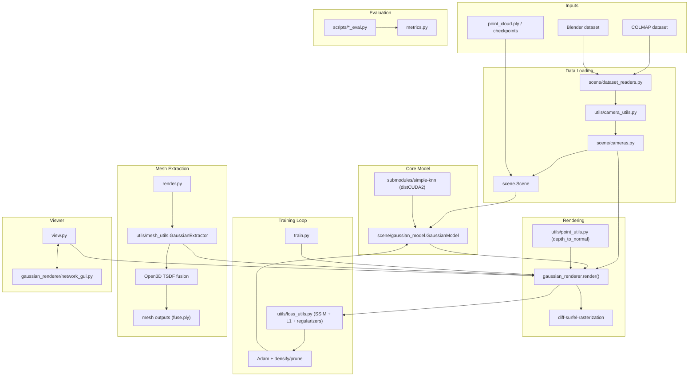
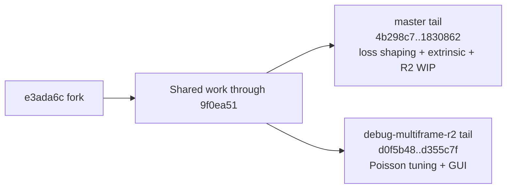
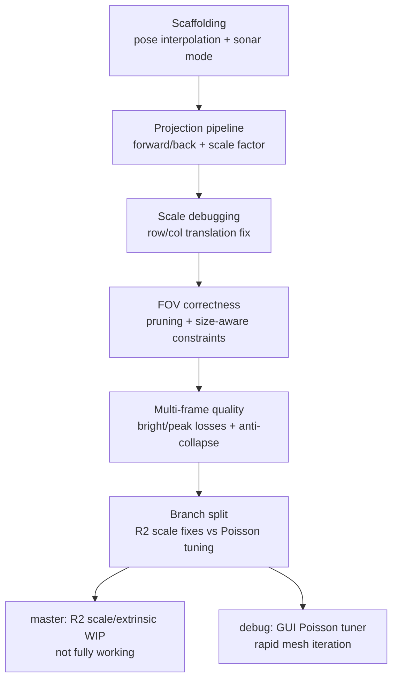

# Progress Overview (Post-Fork, Multi-Branch)

## 2026-03-18 Chunk-5 TDD and Runtime Wiring
- Added the first Chunk-5 helper/test tranche: schedule, confidence-mask, checkpoint, mode-gating, densify-gating, and point-utils contracts now live under `tests/test_elevation_chunk5_*` with `utils/elevation_chunk5_helpers.py` as the initial helper surface.
- Wired `debug_multiframe.py` to parse Chunk-5 config, log Chunk-5 modes, carry a sibling `elevation_chunk5_state` checkpoint payload, and restore/reset that state under an explicit mismatch policy.
- Implemented the first real late-normal runtime path in `debug_multiframe.py`: sparse Stage-1 anchor pixels now request an explicit local 4-neighborhood closure, compute expected-elevation world points, derive finite-difference normals, associate them back to visible surfels with the existing Chunk-4 gates, and add cosine normal supervision once into the unified Stage-2/Stage-3 loss.
- Extended `utils/point_utils.py` so the sonar point-conversion path accepts optional per-pixel elevation while preserving `elevation_image=None` parity with the previous zero-elevation behavior.
- Added densify shadow scaffolding only: high-error tracker updates, trigger diagnostics, and checkpoint persistence exist, but active surfel spawning is still intentionally unimplemented.
- Posture note: because default `ELEV_NORMAL_MODE` remains `shadow`, this wiring is treated as implementation prep rather than gate evidence. Any ad hoc `ELEV_NORMAL_MODE=active` run executed before the Chunk-3 / Chunk-4.5 readiness prerequisites close must not be used as formal Chunk-5 gate evidence.
- Follow-up wiring now extends Chunk 5 beyond helper-only prep: active densify spawning exists, spawn orientation prefers local expected normals when the neighborhood is valid, focused runtime smokes pass for both active late normals and active densify, and tracker/checkpoint hygiene was tightened for stale bank entries and empty frame-key payloads.
- Repair pass after commit review closed the main remaining Chunk-5 plan gaps: the late-normal path now rejects degenerate finite-difference geometry instead of treating zero vectors as valid supervision, `ELEV_STAGE2_START_ITER` is back to the fixed `12000` default, and Chunk-5 densify is now gated on the renderer-v2 contract (`SONAR_RENDER_MODE=2dgs`, `SONAR_OCCLUSION_MODE=ray_binned`).
- The Chunk-5 densify event path now records real shadow-mode diagnostics, consumes renderer-v2 densification signals (`viewspace_points.grad`, `radii`, `max_radii2D`), reports candidate/support/explained-skip counts directly in the runtime logs, and performs duplicate suppression against both existing visible surfels and already-accepted spawns from the same event.
- Verification status for this repair pass: focused contract tests pass (`30 passed, 2 skipped`) and the opt-in runtime smokes for active late normals plus active densify also pass (`2 passed`).

## 2026-03-17 Chunk-5 Plan Tightening
- Tightened `plans/PLAN_ELEVATION_AWARE_CHUNK5_EXECUTION_2026-03-16.md` against upstream plans and current code reality before any Chunk-5 TDD work begins.
- Clarified that late-normal finite-difference supervision must explicitly materialize the image-grid 4-neighborhood around sparse Stage-1 anchor pixels rather than assuming dense pixel-bank support.
- Clarified that Chunk-5 introduces a new explicit normal-supervision term into `debug_multiframe.py`, requires `SONAR_OCCLUSION_MODE=ray_binned` for densification eligibility, and should store resume state in a sibling `elevation_chunk5_state` payload.
- Corrected the reduced-budget synthetic command examples so they explicitly override iteration gates when they are intended to exercise late normals or densification.

## 2026-03-12 Evidence Split Note
- Chunk 4.5 (renderer remediation) now sits between Chunk 4 and Chunk 5 in the planning hierarchy.
- Treat pre-v2 Chunk-4 evidence as historical when comparing against runs that use renderer-v2 semantics.
- Current posture is mixed: Chunk 4.5 is implemented in code, but post-v2 active-path validation and synthetic re-baselining are still open, so Chunk 5 is not yet on a clean baseline.

## 2026-03-11 Sonar Visualizer Checkpoint
- Added Blender-first offline visualizer exports for `debug_multiframe.py`: stage-aligned surfel-state PLYs, deterministic sampled surfel glyphs, per-frame near/full-range wireframes, per-frame rendered sonar PNGs, and a narrow `visualizer/manifest.json` index.
- Fixed an important geometry bug in the initial visualizer pass: near and full-range wireframes now share the same sonar-angle envelope instead of mixing a rectangular forward-depth pyramid with a constant-range FOV shell.
- Tightened per-frame surfel selection so exported frame glyphs prefer surfels centered inside the current frame FOV before falling back to size-aware overlap candidates.
- Added `SONAR_FRAME_SELECTION=first` so controlled manual reviews can use contiguous early frames instead of evenly spaced views.
- First meaningful cube sanity check landed in `output/debug_multiframe_synth_c_first6/`: frames `sonar_000000`..`sonar_000005` all observe the same cube face, and the visualizer shows a readable straight surfel band at that face instead of an incoherent cloud.
- Qualitative status: surfel orientations are still noisy/randomized, but the visualizer now makes it obvious that many surfels face toward the observing sonar poses rather than away; this is the first cube-dataset visualization that is remotely interpretable for manual diagnosis.
- Follow-up temporary probe `output/debug_multiframe_synth_c_10frames_90deg/` (10 frames spanning about 90 degrees of the 500-frame orbit) falls back to the familiar torus symptom, which matches expectations because only visualization/export and temporary frame selection changed; no surfel-learning logic was altered.
- Formalized the previously dirty `diff-surfel-rasterization` backend patch by preserving its `additive_mode` source changes in submodule history; this matters because the active sonar renderer path in `gaussian_renderer/__init__.py` already depends on additive accumulation semantics.

## 2026-03-10 Renderer WIP Update
- Replayed the renderer-fix synthetic sphere gate and confirmed the active v2 path was still broken before the latest patch: `C4-S1` failed with NaN diagnostics and a no-grad backward crash.
- Patched `gaussian_renderer/__init__.py` to keep sonar event accumulation differentiable, switch ray-binned transmittance compositing to log-space, and clamp NaN/Inf event-volume outputs before loss computation.
- Focused renderer contracts now pass again (`RB-T05`, `RB-T08`, `RB-T16`, `RB-T20`, `RB-T21`) and the runtime smoke contracts (`RB-T11`, `RB-T12`) pass under `SONAR_RENDER_MODE=2dgs`, `SONAR_OCCLUSION_MODE=ray_binned`, `SONAR_LAMBERTIAN_MODE=leaky`.
- Synthetic smoke reruns now complete for both `synthetic_sphere_A_clean` and `synthetic_cube_C_clean` at `50` frames / `100` stage-2 iterations, with finite final-eval losses and produced surfel outputs.
- Visual quality is still not materially improved relative to the last manual review, so this commit should be treated as renderer-stability WIP rather than a completed renderer-baseline closure.
- Planning consequence: the current branch evidence should be read as post-v2-stability WIP, not as a completed post-v2 Chunk-4 re-gate.

## Current Architecture (Sonar Extensions)

```mermaid
flowchart TB
  classDef new fill:#2196f3,color:#fff,stroke:#1565c0,stroke-width:1px

  subgraph "Inputs"
    Colmap["COLMAP dataset"]
    Blender["Blender dataset"]
    SonarImages["Sonar images sonar/"]:::new
    PoseInterp["scripts/interpolate_sonar_poses.py"]:::new
    Checkpoint["point_cloud.ply / checkpoints"]
  end

  subgraph "Data Loading"
    DatasetReaders["scene/dataset_readers.py"]
    CameraUtils["utils/camera_utils.py"]
    Cameras["scene/cameras.py"]
    Scene["scene.Scene"]
  end

  subgraph "Sonar Utilities"
    SonarConfig["utils/sonar_utils.SonarConfig"]:::new
    SonarScale["utils/sonar_utils.SonarScaleFactor"]:::new
    SonarExtrinsic["utils/sonar_utils.SonarExtrinsic"]:::new
  end

  subgraph "Core Model"
    GaussianModel["scene/gaussian_model.GaussianModel"]
    SimpleKNN["submodules/simple-knn distCUDA2"]
  end

  subgraph "Rendering"
    RenderCamera["gaussian_renderer.render"]
    RenderSonar["gaussian_renderer.render_sonar"]:::new
    Rasterizer["diff-surfel-rasterization"]
    PointCamera["utils/point_utils depth_to_normal"]
    PointSonar["utils/point_utils sonar_ranges_to_points + sonar_points_to_normals"]:::new
    SonarMasks["Sonar FOV + intensity masks"]:::new
  end

  subgraph "Training Loop"
    Train["train.py"]
    Losses["utils/loss_utils.py SSIM + L1 + regularizers"]
    Optimizer["Adam + densify/prune"]
    SonarScaleOpt["Sonar scale optimizer"]:::new
  end

  subgraph "Mesh Extraction"
    Render["render.py"]
    GaussianExtractor["utils/mesh_utils.GaussianExtractor"]
    Open3D["Open3D TSDF fusion"]
    Mesh["mesh outputs fuse.ply"]
    PoissonTuner["scripts/poisson_tuner_gui.py"]:::new
  end

  subgraph "Viewer"
    View["view.py"]
    NetworkGUI["gaussian_renderer/network_gui.py"]
  end

  subgraph "Evaluation"
    EvalScripts["scripts/*_eval.py"]
    Metrics["metrics.py"]
  end

  Colmap --> DatasetReaders
  Blender --> DatasetReaders
  Colmap --> PoseInterp
  SonarImages --> PoseInterp
  PoseInterp --> DatasetReaders
  DatasetReaders --> CameraUtils
  CameraUtils --> Cameras
  Cameras --> Scene
  Checkpoint --> Scene

  Scene --> GaussianModel
  SimpleKNN --> GaussianModel

  Cameras --> RenderCamera
  GaussianModel --> RenderCamera
  RenderCamera --> Rasterizer
  PointCamera --> RenderCamera

  Cameras --> RenderSonar
  GaussianModel --> RenderSonar
  SonarConfig --> RenderSonar
  SonarScale --> RenderSonar
  SonarExtrinsic --> RenderSonar
  RenderSonar --> Rasterizer
  PointSonar --> RenderSonar
  RenderSonar --> SonarMasks

  Train --> RenderCamera
  Train --> RenderSonar
  RenderCamera --> Losses
  RenderSonar --> Losses
  Losses --> Optimizer
  Optimizer --> GaussianModel
  Train --> SonarScaleOpt
  SonarScaleOpt --> SonarScale

  Render --> GaussianExtractor
  GaussianExtractor --> RenderCamera
  GaussianExtractor --> Open3D
  Open3D --> Mesh
  Mesh --> PoissonTuner

  View --> RenderCamera
  View <--> NetworkGUI

  EvalScripts --> Metrics
```

## Baseline Architecture (Commit 0d41037)

```mermaid
flowchart TB
  subgraph "Inputs"
    Colmap["COLMAP dataset"]
    Blender["Blender dataset"]
    Checkpoint["point_cloud.ply / checkpoints"]
  end

  subgraph "Data Loading"
    DatasetReaders["scene/dataset_readers.py"]
    CameraUtils["utils/camera_utils.py"]
    Cameras["scene/cameras.py"]
    Scene["scene.Scene"]
  end

  Colmap --> DatasetReaders
  Blender --> DatasetReaders
  DatasetReaders --> CameraUtils
  CameraUtils --> Cameras
  Cameras --> Scene
  Checkpoint --> Scene

  subgraph "Core Model"
    GaussianModel["scene/gaussian_model.GaussianModel"]
    SimpleKNN["submodules/simple-knn (distCUDA2)"]
  end
  Scene --> GaussianModel
  SimpleKNN --> GaussianModel

  subgraph "Rendering"
    Renderer["gaussian_renderer.render()"]
    Rasterizer["diff-surfel-rasterization"]
    PointUtils["utils/point_utils.py (depth_to_normal)"]
  end
  Cameras --> Renderer
  GaussianModel --> Renderer
  Renderer --> Rasterizer
  PointUtils --> Renderer

  subgraph "Training Loop"
    Train["train.py"]
    Losses["utils/loss_utils.py (SSIM + L1 + regularizers)"]
    Optimizer["Adam + densify/prune"]
  end
  Train --> Renderer
  Renderer --> Losses
  Losses --> Optimizer
  Optimizer --> GaussianModel

  subgraph "Mesh Extraction"
    Render["render.py"]
    GaussianExtractor["utils/mesh_utils.GaussianExtractor"]
    Open3D["Open3D TSDF fusion"]
    Mesh["mesh outputs (fuse.ply)"]
  end
  Render --> GaussianExtractor
  GaussianExtractor --> Renderer
  GaussianExtractor --> Open3D
  Open3D --> Mesh

  subgraph "Viewer"
    View["view.py"]
    NetworkGUI["gaussian_renderer/network_gui.py"]
  end
  View --> Renderer
  View <--> NetworkGUI

  subgraph "Evaluation"
    EvalScripts["scripts/*_eval.py"]
    Metrics["metrics.py"]
  end
  EvalScripts --> Metrics
```

## Scope and Method
- Fork point: `e3ada6c`.
- Branches analyzed: `master`, `debug-multiframe-r2` (local).
- Evidence: commit history, diff stats, and plan/progress docs (`plans/*.md`, `PROGRESS.md`, `progress.md`, `SONAR_MODIFICATIONS.md`, `docs/DESIGN_DECISIONS.md`, `DATASET_PREPARATION.md`, `R2_DATASET_ISSUES.md`).
- Effort proxy: commit count, diff stats (files/lines), plus narrative notes from plans and progress logs.

## Branch Summary
| Branch | Commits since fork | Diff stats since fork | Focus tail (unique to branch) |
| --- | --- | --- | --- |
| `master` | 19 | 22 files, 6285 insertions, 42 deletions | Peak-aware/anti-collapse loss, extrinsic offset, R2 scale WIP (5 unique commits) |
| `debug-multiframe-r2` | 17 | 27 files, 6295 insertions, 41 deletions | Poisson mesh filters, GUI tuner, brightness slider (3 unique commits) |

```mermaid
flowchart LR
    base[e3ada6c fork] --> shared[Shared work through 9f0ea51]
    shared --> master_tail[master tail\n4b298c7..1830862\nloss shaping + extrinsic + R2 WIP]
    shared --> debug_tail[debug-multiframe-r2 tail\nd0f5b48..d355c7f\nPoisson tuning + GUI]
```

## Approach Ledger (What Was Tried, Effort, Outcome)

### 1) Sonar mode + pose interpolation scaffolding
- Evidence: `a5ef72d`, `4958d0d`; docs `SONAR_MODIFICATIONS.md`, `DATASET_PREPARATION.md`.
- Effort proxy: 2 commits, 6 files changed, 854 insertions, 3 deletions.
- What was done: sonar mode toggle, pose interpolation script, dataset conventions, early extrinsic TODO.
- Outcome: foundation laid for sonar-specific data flow and COLMAP pose reuse.
- Friction later: naming constraints (camera_*.png) and dataset mismatches show up in R2 notes (`R2_DATASET_ISSUES.md`).

### 2) Core sonar projection pipeline + scale factor + debug harness
- Evidence: `71b82f8`, `a844961`, `0b503ab`, `6c7f2de`, `9379438`, `929568d`; docs `PROGRESS.md`, `docs/DESIGN_DECISIONS.md`, `SONAR_MODIFICATIONS.md`.
- Effort proxy: 7 commits, 15 files changed, 3740 insertions, 60 deletions.
- What was done:
  - `render_sonar()` forward projection and `sonar_ranges_to_points()` backward projection.
  - `SonarScaleFactor` for metric alignment; gradient bug fixed via row-3 translation.
  - Debug scripts to validate backward+forward reproduction.
- Outcome: working sonar render path with scale sensitivity; debug shows correct reproduction.
- Stuck point: scale learning still drifts to ~1.0 when expected ~0.66 (not fully resolved in `PROGRESS.md`).

### 3) FOV correctness, pruning, and size-aware constraints
- Evidence: `63f287a`, `a76ae8e`, `389f9d2`, `df8428e`; plan `plans/PLAN_sonar_mesh_extraction.md`; notes in `progress.md`.
- Effort proxy: 4 commits, 5 files changed, 745 insertions, 31 deletions.
- What was done: intensity thresholding, freeze scale factor, FOV pruning, size-aware FOV checks.
- Outcome: surfels largely constrained to FOV; mesh still extends slightly beyond due to TSDF interpolation.
- Stuck point: residual mesh outside FOV and early mesh-before-training mismatch noted in `progress.md`.

### 4) Multi-frame fidelity and highlight preservation
- Evidence: `9f0ea51` (shared), `4b298c7`, `ff4aac6` (master only).
- Effort proxy:
  - Shared: 1 commit, 2 files changed, 193 insertions, 12 deletions.
  - Master tail (loss shaping): part of 5 commits, 1019 insertions, 202 deletions (see approach 5).
- What was done: bright-pixel loss, peak-aware loss, anti-collapse loss, peak-gated pruning.
- Outcome: attempts to preserve thin bright returns and prevent collapse.
- Stuck point: multi-frame loss oscillations and missing fine bright dots noted in `PROGRESS.md`.

### 5) Extrinsic offset + R2 scale/mesh debugging (master track)
- Evidence: `cec5c77`, `37d763c`, `1830862`; docs `progress.md`, `R2_DATASET_ISSUES.md`.
- Effort proxy: 5 commits in master tail, 1019 insertions, 202 deletions (overlaps with approach 4 work).
- What was done: applied sonar extrinsic offset, anti-collapse improvements, attempted R2 scale fixes and row/col translation convention fix (WIP).
- Outcome: partial fixes; some were marked broken or not fully working.
- Stuck points (from `progress.md` and `R2_DATASET_ISSUES.md`):
  - R2 dataset is not just pose update; intrinsics and frames differ, scale is non-uniform.
  - FOV visibility remains sparse; some points behind sonar due to transform mismatch.
  - Mesh scale/offset issues persist; WIP fixes not fully validated.

### 6) Poisson mesh tuning + GUI workflow (debug-multiframe-r2 track)
- Evidence: `d0f5b48`, `b2e1fcb`, `d355c7f`; plans `PLAN_GUI_POISSON_TUNER_2026-01-17.md`, `PLAN_R2_MESH_GAP_2026-01-17.md`, `PLAN_R2_SCALE_FIX_2026-01-17.md`.
- Effort proxy: 3 commits, 11 files changed, 912 insertions, 84 deletions.
- What was done: Poisson mesh filters, GUI-based tuner, brightness slider for rapid iteration.
- Outcome: tooling in place for tuning mesh extraction, but still WIP and not tied to a resolved R2 scale fix.
- Stuck point: plan explicitly flags unreliable prior fixes and requires re-validation.

## Effort Heatmap (By Subsystem and File)

### Subsystem Churn (master)
| Subsystem | Insertions | Deletions | Total churn |
| --- | --- | --- | --- |
| Debug Pipelines | 3168 | 367 | 3535 |
| Docs/Notes | 1672 | 60 | 1732 |
| Sonar Utils | 776 | 78 | 854 |
| Scripts/Tools | 609 | 0 | 609 |
| Rendering Core | 396 | 50 | 446 |
| Training/Scene | 193 | 22 | 215 |

### Subsystem Churn (debug-multiframe-r2)
| Subsystem | Insertions | Deletions | Total churn |
| --- | --- | --- | --- |
| Debug Pipelines | 2600 | 174 | 2774 |
| Docs/Notes | 1848 | 40 | 1888 |
| Scripts/Tools | 892 | 1 | 893 |
| Sonar Utils | 693 | 27 | 720 |
| Rendering Core | 394 | 49 | 443 |
| Training/Scene | 133 | 21 | 154 |

### Top Churn Files (master)
| File | Insertions | Deletions | Total churn |
| --- | --- | --- | --- |
| `debug_multiframe.py` | 2166 | 286 | 2452 |
| `utils/sonar_utils.py` | 581 | 68 | 649 |
| `debug_before_after_mesh.py` | 541 | 81 | 622 |
| `scripts/interpolate_sonar_poses.py` | 518 | 0 | 518 |
| `gaussian_renderer/__init__.py` | 396 | 50 | 446 |
| `PROGRESS.md` | 408 | 30 | 438 |

### Top Churn Files (debug-multiframe-r2)
| File | Insertions | Deletions | Total churn |
| --- | --- | --- | --- |
| `debug_multiframe.py` | 1598 | 93 | 1691 |
| `debug_before_after_mesh.py` | 541 | 81 | 622 |
| `scripts/interpolate_sonar_poses.py` | 518 | 0 | 518 |
| `utils/sonar_utils.py` | 496 | 16 | 512 |
| `gaussian_renderer/__init__.py` | 394 | 49 | 443 |
| `scripts/poisson_tuner_gui.py` | 283 | 1 | 284 |

## Decision Timeline (Pivots and Outcomes)

```mermaid
flowchart TB
    T0[Scaffolding\npose interpolation + sonar mode] --> T1[Projection pipeline\nforward/back + scale factor]
    T1 --> T2[Scale debugging\nrow/col translation fix]
    T2 --> T3[FOV correctness\npruning + size-aware constraints]
    T3 --> T4[Multi-frame quality\nbright/peak losses + anti-collapse]
    T4 --> T5[Branch split\nR2 scale fixes vs Poisson tuning]
    T5 --> T6[master: R2 scale/extrinsic WIP\nnot fully working]
    T5 --> T7[debug: GUI Poisson tuner\nrapid mesh iteration]
```

## Where Progress Slowed or Stuck
- **Scale factor learning**: documented convergence mismatch (expected ~0.66 vs learned ~1.0). Fixes improve gradient flow but not convergence.
- **R2 dataset shift**: pose and intrinsics differences plus frame mismatch make it a new dataset, not a drop-in replacement; scale and orientation variance break assumptions.
- **FOV and mesh consistency**: even with size-aware FOV, TSDF/marching cubes introduce out-of-FOV mesh surface; mesh gaps persist in R2.
- **Multi-frame quality**: oscillating losses and missing bright dots led to repeated loss shaping and pruning iterations.

## LLM Plan Inventory and Status
| Plan doc | LLM attribution | Goal | Status |
| --- | --- | --- | --- |
| `plans/PLAN_sonar_mesh_extraction.md` | Claude Opus 4.5 | Size-aware FOV constraints | Implemented (`df8428e`); residual FOV mesh leakage remains. |
| `plans/PLAN_R2_SCALE_FIX_2026-01-17.md` | Not specified | R2 scale alignment | Still WIP; fixes marked unreliable. |
| `plans/PLAN_R2_MESH_GAP_2026-01-17.md` | Not specified | Diagnose R2 mesh gaps | Not resolved; Poisson fallback proposed. |
| `plans/PLAN_GUI_POISSON_TUNER_2026-01-17.md` | Not specified | GUI for Poisson tuning | WIP tooling added in debug branch. |

## Strategic Takeaways
- Most effort has gone into the core projection pipeline and debug harness, followed by repeated quality tuning and pruning.
- The project shifted from geometry correctness to quality tuning, then to dataset-specific fixes (R2) and mesh tooling.
- The main blockers are scale identifiability and R2 dataset non-equivalence, which both undermine downstream mesh quality.

## Recent Updates (2026-01-27)
- Single-frame R2 run recorded (see snapshots) showed good surfel alignment but TSDF meshes outside FOV and often empty; Poisson meshes succeeded.
- Added `SONAR_NUM_FRAMES` env override in `debug_multiframe.py` to control training frame count.
- Fixed Poisson filtering alignment bug when applying opacity + scale filters sequentially.
- Recorded mesh extraction notes and sonar-native TSDF plan in snapshots for future implementation.

## Recent Updates (2026-02-11 to 2026-02-15)
- Chunk 2 implementation was extended with deterministic Stage-0 controls and observability in `debug_multiframe.py`:
  - optional holdout split (`SONAR_HOLDOUT_FRAMES`),
  - per-frame final evaluation CSVs (`final_eval_train_frames.csv`, `final_eval_holdout_frames.csv`),
  - frame-visit coverage (`frame_training_visits.csv`),
  - multi-view support diagnostics (`support_metrics_train*.csv`).
- Two 8-train + 2-holdout baselines were recorded for Chunk-3/4 comparison:
  - fixed opacity (primary): holdout/train loss ratio `1.52x`, `support>=3 = 0.0446`, `median_support = 1.0`,
  - learnable opacity (secondary ablation): holdout/train loss ratio `1.52x`, `support>=3 = 0.0439`, `median_support = 1.0`.
- Manual tagged review confirmed weak overlap-critical behavior persists (notably frame2/frame3), while frame0 tends to dominate due to weak overlap.
- Strategic pivot formalized in the Chunk 2 plan: stop trying to optimize overlap quality inside Chunk 2; carry overlap/coupling fixes into Chunk 3 (overlap/sampler/likelihood) and Chunk 4 (coupling/support pruning).
- Non-blocking but tracked issues: intermittent `sys.unraisablehook` teardown warning and TSDF path frequently writing empty meshes in these sonar runs.

## Recent Updates (2026-02-15 to 2026-02-16)
- Implemented synthetic Dataset A tooling end-to-end: `scripts/generate_synthetic_sonar_dataset.py`, `scripts/eval_synthetic_sphere.py`, and one-command gate runner `scripts/run_synthetic_a_gate.py`.
- Standardized canonical acceptance mode to sonar poses (`--pose-mode sonar_equivalent`), with camera-extrinsic mode retained as optional diagnostic only.
- Full-quality Dataset A gate now passes in canonical mode with stable repeatability across two runs (consistency gate pass + eval threshold pass + drift pass).
- Chunk-1/2 validation refresh completed after gate integration: init-only smoke pass, `ELEV_INIT_MODE=random` spread confirmed, `ELEV_INIT_MODE=zero` parity contract pass, fixed-opacity behavior confirmed, and save/load resume continuation pass.
- Recorded a follow-up risk for later work: single-orbit pose sampling concentrates FOV near an equatorial band and can bias surfel centers toward a cylindrical shell; multi-orbit/random-shell sampling was added to plan backlog.

## Recent Updates (2026-02-16 Dataset C Track)
- Implemented Dataset C (cube vacuum) end-to-end tooling: generator extensions in `scripts/generate_synthetic_sonar_dataset.py`, evaluator `scripts/eval_synthetic_cube.py`, and gate runner `scripts/run_synthetic_c_gate.py`.
- Added Dataset C integration in `debug_multiframe.py` (`SONAR_DATASET=synthetic_c_clean`) and updated usage docs in `docs/SYNTHETIC_DATASET_GUIDE.md`.
- Canonical Dataset C gate executed with multi-band poses; consistency and reproducibility gates pass, but both training runs fail cube reconstruction thresholds (`mean~0.090 m`, `p95~0.234 m`).
- Follow-up tuning experiments (longer stage budgets, range-attenuation-off, zero-elevation init, learnable-opacity ablation) improved little and still fail thresholds (`exp1 mean/p95 ~0.085/0.214`, `exp2 ~0.089/0.231`).
- Current handoff assessment: likely Chunk-2 quality ceiling; probable unblock is Chunk 3/4 overlap-likelihood + belief-to-geometry coupling work before expecting Dataset C acceptance.

## Recent Updates (2026-02-20 to 2026-02-21, Chunk 3 execution)
- `debug_multiframe.py` Chunk-3 Stage-1 runtime was tightened: removed hardcoded CUDA bin-center allocation, fixed OOB support masking to validity-aware masks, and removed resume-time double init of pixel logits/optimizer.
- Added refresh/remap runtime wiring in Stage 2/3 (`ELEV_BANK_REFRESH_INTERVAL`, `ELEV_BANK_REMAP_MODE`, `ELEV_BANK_REMAP_MAX_DIST`) with deterministic `optim_elev` rebuild on shape changes.
- Unified effective-mode logic to use helper contract (`resolve_effective_stage1_mode`) in config parsing.
- Fast contract/smoke tests are green in conda env: core contracts (17), checkpoint contracts (10), smoke modes (10).
- Status correction for Chunk 3: runtime infrastructure is implemented, but full detailed-plan Stage-1 parity is still open; current training-loop likelihood remains an interim per-frame surrogate and does not yet consume overlap-neighbor multi-view `back_project_bins` evidence end-to-end.
- Re-verified on current codebase: `python -m py_compile debug_multiframe.py utils/elevation_stage1_helpers.py` and `pytest tests/test_elevation_stage1_core_contracts.py tests/test_elevation_stage1_checkpoint_contracts.py tests/test_elevation_stage1_smoke_modes.py -q` -> `37 passed`.
- Synthetic matrix execution refresh:
  - S1 (`output/debug_multiframe_synth_gate_summary.json`): pass.
  - S2 (`output/debug_multiframe_synth_c_gate_summary.json`): consistency+repro pass, run thresholds still fail (overall false), with current run metrics around mean/p95 `0.08797/0.22886`.
  - S3 (`output/chunk3_s3/debug_multiframe_synth_s3_gate_summary.json`): pass; low drift vs S1 (mean delta ~`7.39e-06`, p95 delta ~`-3.54e-05`, center delta ~`2.59e-05`).
  - S4 continuation: checkpoint save/load path validated with restored Stage-1 state (schema/fingerprint/sampler/pixel logits) and continuation evaluator output at `output/chunk3_s4_run2/eval_surfel/cube_eval.json`.
- Resume-state evidence from S4:
  - checkpoint saved: `output/chunk3_s4_run1/chunk3_s4_ckpt.pth`,
  - restore log: `output/chunk3_s4_run2/run.log` shows loaded iter `601`, sampler restore (`cursor=303, epoch=3`), and pixel-logit restore (`restored=500, reset=0`),
  - checkpoint payload includes `checkpoint_schema_version=chunk3_stage1_v1` and active-frame fingerprint.

## Recent Updates (2026-02-22, Chunk-3 statistical gate refinement)
- Baseline-relative S2 regression remains formally true versus Chunk-2 comparator (`output/debug_multiframe_synth_c_exp3/eval_surfel/cube_eval.json` -> `output/debug_multiframe_synth_c_run1/eval_surfel/cube_eval.json`), with center error changing `0.00654 -> 0.02364` m.
- Additional off-vs-shadow parity sweeps were run to check whether Stage-1 plumbing itself is the main source of drift:
  - short budget seeds (`42/101/202`) in `output/chunk3_seed_sweep/*` show mixed signed center deltas,
  - full-budget seeds (`77/303/404`) in `output/chunk3_seed_sweep_full/*` also show mixed signed center deltas.
- Interpretation: no consistent directional evidence that `ELEV_STAGE1_MODE=shadow` is intrinsically worse than `off`; Dataset-C behavior appears seed-sensitive with persistent cube-shape difficulty.
- Comparator hygiene issue was identified and corrected: for seeds `303/404`, initial mesh-based eval (`mesh_after_stage3.ply`) overstated center error and was replaced by comparable surfel-based eval (`surfels_after_training.ply`) at:
  - `output/chunk3_seed_sweep_full/seed303_off/eval_surfel_surfels/cube_eval.json`
  - `output/chunk3_seed_sweep_full/seed303_shadow/eval_surfel_surfels/cube_eval.json`
  - `output/chunk3_seed_sweep_full/seed404_off/eval_surfel_surfels/cube_eval.json`
  - `output/chunk3_seed_sweep_full/seed404_shadow/eval_surfel_surfels/cube_eval.json`
- Practical handoff stance for Chunk 4: carry a documented S2 center-error risk/waiver note, then evaluate whether coupling/support logic reduces center-error variance and cross-view dominance.

## Recent Updates (2026-02-24, Chunk-4 TDD test harness)
- Added Chunk-4 helper contracts and initial implementation in `utils/elevation_chunk4_helpers.py` for coupling association/reduction, persistent surfel-ID lifecycle, by-ID support updates, support schedule/hysteresis/grace logic, and checkpoint resume-policy handling.
- Added fast contract test files:
  - `tests/test_elevation_chunk4_coupling_contracts.py` (`C4-T01`, `C4-T02`, `C4-T03`, `C4-T10`),
  - `tests/test_elevation_chunk4_id_support_lifecycle.py` (`C4-T04`..`C4-T08`),
  - `tests/test_elevation_chunk4_checkpoint_contracts.py` (`C4-T09`).
- Added smoke/matrix harness files:
  - `tests/test_elevation_chunk4_smoke_modes.py` with placeholder mode-gate tests plus opt-in runtime smokes for `C4-T11`..`C4-T14` (`RUN_CHUNK4_RUNTIME_SMOKES=1`),
  - `tests/test_elevation_chunk4_synthetic_matrix.py` with opt-in synthetic matrix/continuation checks for `C4-T15`..`C4-T16` (`RUN_CHUNK4_SYNTHETIC_MATRIX=1`) and manual placeholder `C4-T17`.
- Local fast-suite status in conda env:
  - `pytest tests/test_elevation_chunk4_coupling_contracts.py tests/test_elevation_chunk4_id_support_lifecycle.py tests/test_elevation_chunk4_checkpoint_contracts.py tests/test_elevation_chunk4_smoke_modes.py tests/test_elevation_chunk4_synthetic_matrix.py -q`
  - result: `29 passed, 7 skipped` (skips are opt-in runtime/synthetic/manual tests).

## Recent Updates (2026-02-24, Chunk-4 coupling runtime integration checkpoint)
- Integrated Chunk-4 coupling runtime path into `debug_multiframe.py` for Stage-2/Stage-3 loops:
  - added `ElevationChunk4Config` parsing for `ELEV_COUPLE_*` and mode controls (`ELEV_COUPLE_MODE`, `ELEV_SUPPORT_MODE`),
  - wired per-frame expected-point computation from Stage-1 posterior cache (`p_post`) via `back_project_bins`,
  - added association/reduction calls (`associate_expected_points_to_surfels`, `reduce_coupling_loss`) and single insertion into unified loss.
- Coupling mode behavior is now explicit:
  - `off`: no coupling diagnostics or weighted term,
  - `shadow`: diagnostics computed; weighted coupling remains disabled,
  - `active`: diagnostics + scheduled coupling weight ramp (`ELEV_COUPLE_WEIGHT_START -> ELEV_COUPLE_WEIGHT_END`).
- Added bounded candidate control (`ELEV_COUPLE_MAX_CANDIDATES`, default `2048`) to cap association cost under dense visibility.
- Fixed runtime teardown stability in logging (`Tee`/stdio restoration) to remove subprocess false-fail exits during pytest runtime smoke execution.
- Validation status in conda env (post-integration):
  - runtime smokes: `RUN_CHUNK4_RUNTIME_SMOKES=1 pytest tests/test_elevation_chunk4_smoke_modes.py -q` -> `10 passed`,
  - synthetic matrix: `RUN_CHUNK4_SYNTHETIC_MATRIX=1 pytest tests/test_elevation_chunk4_synthetic_matrix.py -q` -> `2 passed, 1 skipped`,
  - full Chunk-4 suite with runtime+synthetic gates: `33 passed, 3 skipped`.
- Scope caveat (important): Chunk-4 runtime wiring is now present for both coupling and support/prune paths, but gate closeout is still **NO-GO** on quantitative/synthetic blockers.

## Recent Updates (2026-02-24, Chunk-4 closeout/gating pass)
- Executed closeout evidence collection with persistent artifacts under `output/chunk4_closeout/gate_logs/`:
  - fast/contract suite log: `c4_fast_contracts.log` (`29 passed, 7 skipped`),
  - runtime smokes log: `c4_runtime_smokes_verbose.log` (`C4-T11`..`C4-T14` all pass),
  - synthetic matrix log: `c4_synthetic_matrix_verbose.log` (`C4-T15`, `C4-T16` pass; `C4-T17` manual skip placeholder).
- Added explicit off-mode parity artifact `output/chunk4_closeout/gate_logs/c4_t11_offmode_parity.json`:
  - relative loss delta `0.0012866` (<= `0.05`),
  - absolute SSIM delta `0.0006394` (<= `0.01`).
- Added coupling-threshold artifact `output/chunk4_closeout/gate_logs/c4_coupling_tail_metrics.json` from active run log parsing:
  - median match rate (tail) `0.9465` (pass),
  - p95-of-p95 coupling residual `0.30195 m` (fails threshold `<= 0.30 m` by `0.00195 m`),
  - assoc weight tail range `0.662..0.772` (pass).
- Published consolidated gate ledger/report:
  - `output/chunk4_closeout/chunk4_gate_closeout_report_2026-02-24.md`,
  - `output/chunk4_closeout/chunk4_gate_closeout_report_2026-02-24.json`.
- Gate outcome recorded as **NO-GO** with explicit blockers:
  - `C4-S2` cube gate remains fail (`output/chunk4_closeout/c4_s2_summary.json`),
  - active coupling residual threshold miss (`0.30195 > 0.30`),
  - manual artifact-panel verdict (`C4-T17`) remains pending by design.

## Recent Updates (2026-02-24, post-closeout harsh ablation visual verdict)
- Ran a harsher Chunk-4 ablation to force support-prune engagement: `output/chunk4_aggressive_probe_run2_harsh/`.
- Manual visual review verdict: **regressed**; the torus did not move toward cube geometry, and approximately half the torus disappeared (collapse-by-pruning behavior).
- Recorded observer note in `output/chunk4_aggressive_probe_run2_harsh/manual_visual_note_2026-02-24.md`.

## Recent Updates (2026-03-25, Backward-Projection Rotation Bug Fix)

- Fixed rotation transpose bug in `sonar_frame_to_points()`: `camera.R` is R_c2w, not R_w2c — the extra `.T` was placing initial surfels ~2 m from correct positions. Forward render path (`render_sonar`) was unaffected.
- Same convention fix applied to all callers in `debug_multiframe.py` and `generate_pose_pyramids.py`.
- Added unambiguous comparison naming (`comparison_<stage>_<idx>_<image>.png`) and `training_frame_index_map.csv`.
- Chunk-5 arc scoring refactored: `build_stage1_multiview_evidence_for_pixels`, `compute_arc_score_contribution`, `select_arc_peak_bin`.
- Post-fix rerun metrics: `loss_mean=0.003451`, `ssim_mean=0.9781`, 717 surfels.
- Details: `docs/SYNTHETIC_DATASET_GUIDE.md` (Backward-Projection Rotation Convention Bug section).
